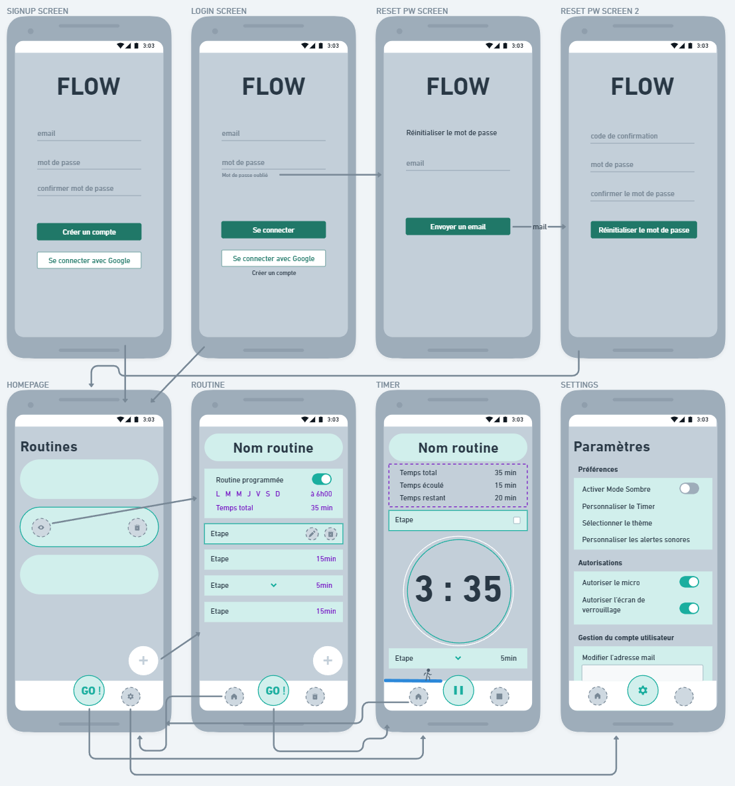
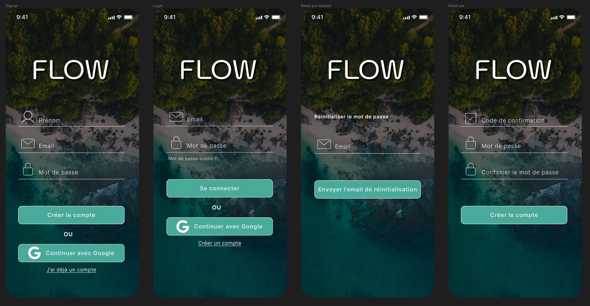

## J'AI FAIT QUOI ?

Du coup, après la folle semaine du Challenge #RamenTaFraise, le calme est revenu sur LinkedIn et nous avons gardé un groupe Discord d’environ une soixantaine de filles du challenge, pour garder le contact, s’entraider, se motiver mutuellement, et c’est vraiment chouette d’avoir cet endroit pour nous je trouve. Pas tout le monde est actif cela dit, mais on verra bien où ça mène.

Ensuite, j’ai pu me reconcentrer sur ma formation Flutterflow. J’ai bien avancé sur les bases, j’attaque enfin la pratique avec la création d’une appli de To-Do list, je suis joie ! 😍

Je me suis aussi beaucoup intéressée aux concepts d’UI / UX (Interface Utilisateur / Expérience Utilisateur) et je dois avouer que ça me passionne aussi énormément. Et je me rends compte que j’ai encore beaucoup de choses à apprendre dans ce domaine-là !…

J’ai bossé sur les “Wireframes” de mon application (le croquis des différents écrans pour les néophytes) avec l’outil Whimsical.

Et j’ai bossé sur le design de l’écran de connexion avec l’outil Figma :

Alors je suis pas designeuse, ça se voit, et ce n’est qu’une première itération, rien n’est définitif. Mais je trouve ça terriblement satisfaisant de voir se concrétiser le commencement de mon premier projet d’application 🤩

Enfin, j’ai eu le privilège d’être “reçue” par Catherine Nempont, que j’ai rencontrée lors du fameux Challenge, et qui m’a proposé de faire mon portrait chinois “Dazibao”. Si vous voulez le découvrir, il paraîtra dans quelques jours (lundi normalement) dans ses posts Linkedin : https://www.linkedin.com/in/catherine-aubin-nempont/

Voilà dans les grandes lignes ma semaine, pas super productive car j’ai été malade une bonne partie du temps ^^

## LA SEMAINE PROCHAINE

Sans grande surprise, je vais continuer d’avancer sur Flutterflow, je me suis fixée une deadline au 15 décembre pour la boucler. Ca me paraît à la fois faisable et à la fois ambitieux, sachant qu’il y a 2 apps à créer de A à Z. Wait and see ?! 🤷‍♀️

Ce soir, j’ai une Masterclass de Théo Leblanc sur “Comment level up son business grâce à l’IA”.

Mardi, outre 3 RDV médicaux pour mon fils et moi, j’ai un Webinaire de Hanitra Roncin sur “Apprendre à se mettre en avant même quand on est timide ou introvertie”.

Samedi, je ferai l’analyse des réponses que j’ai obtenues à mon enquête utilisateur et je verrai comment prendre en compte les différents retours dans la création de mon application.

## ET ENSUITE ?

Ce qui me fait peut-être défaut, c’est que je n’ai pas planifié au carré la suite des événements. Du moins, je sais ce que je dois faire, mais j’ai du mal à définir des échéances… Or je sais que c’est très important pour le succès d’un projet de définir des objectifs “SMART” :

**Specific** : Clairement défini.

**Measurable** : je dois pouvoir évaluer le succès, le quantifier.

**Achievable** : réaliste et réalisable en fonction de ses ressources et de ses contraintes

**Relevant** : pertinent selon mes aspirations à long terme, aligné sur mes valeurs

**Time-bound** : avec une échéance clairement définie

Je vais peut-être tenter de le faire ici, en direct.

## Ojectif final :

Devenir développeuse d’applications web et mobile pour mon compte, donc créer mes propres applications.

Plan B : me mettre en Freelance pour développer les applications de clients.

## Etapes :

- ME FORMER SUR BUBBLE : OK

- ME FORMER SUR FLUTTERFLOW

  - spécifiquement, terminer la formation que j’ai achetée

  échéance : 15/12/2023

- ME FORMER AUX BASES DE L’UI / UX

  - spécifiquement, suivre le cours “UX design : découvrez les fondamentaux !” sur Openclassrooms, et trouver et suivre un cours un peu similaire sur l’UI.

  échéance : 31/12/2023

- DEVELOPPER MA PREMIERE APPLICATION “FLOW”

  - spécifiquement, bâtir le MVP (Minimum Viable Product) et la faire tester aux utilisateurs intéressés ayant répondu à mon enquête

  échéance : 31/01/2024

- UPGRADER “FLOW” EN 2.0

  - Spécifiquement, en tenant compte des retours des utilisateurs, corriger les bugs et apporter les améliorations nécessaires pour avoir une application clean et 100% fonctionnelle. Ajouter les features complémentaires que je jugerai utiles

  échéance : 31/03/2024

- DEVELOPPER 3 ou 4 AUTRES PROJETS D’APPLICATIONS WEB et/ou MOBILE

  - spécifiquement m’entraîner et gagner en expertise

  échéance : 30/06/2024

A partir de là, je pense que je déterminerai quelle plateforme je préfère entre Bubble et Flutterflow et que je me spécialiserai à fond (j'ai déjà mon idée 🤭).

Ensuite, si mes applications se vendent bien… roule ma poule ! Si elles se vendent moins bien, je me créerai un Portfolio et je chercherai des clients pour développer en Freelance.

Entre temps, il faudrait que je me pose et que je réfléchisse à ma stratégie de communication. J’aime beaucoup LinkedIn pour certains aspects, mais certains de mes projets d’applications ne ciblent pas forcément les pros, donc je ne sais pas comment m’y prendre pour communiquer dessus…?

Enfin, lorsque je commencerai le développement de “Flow”, qui se fera principalement le soir entre 21h et 23h environ, je projette de streamer mes sessions sur Twitch, en mode “Code with Me”. C’est très niche, ça n’attirera pas forcément de monde et ce n’est pas le but, mais ça me permettra de faire quelques rencontres, de partager ma passion, mes galères, et de compléter la “documentation” de mon projet que je fais déjà ici à l’écrit. Ca me permettra aussi de sortir un peu de ma zone de confort, “ma grotte”.

A savoir que le stream n’est pas nouveau pour moi, j’ai déjà streamé du jeu vidéo, mais ça, c’était avant d’avoir ma petite deuxième ^^ depuis, je n’ai jamais retrouvé l’énergie ou la motivation ! 😅

Voilà, je pense qu’on a fait le tour pour ce petit Compte-rendu, un peu plus axé sur le futur 😊 C’était plus long que je le pensais et si tu as lu jusqu’ici, t’es un(e) boss ! 😎

Comme d’habitude si tu veux me donner ton avis, des conseils ou des critiques constructives, je t’invite à le faire juste en-dessous ⬇️

Et en attendant, je te dis porte toi bien, et à la semaine prochaine ! 💫
