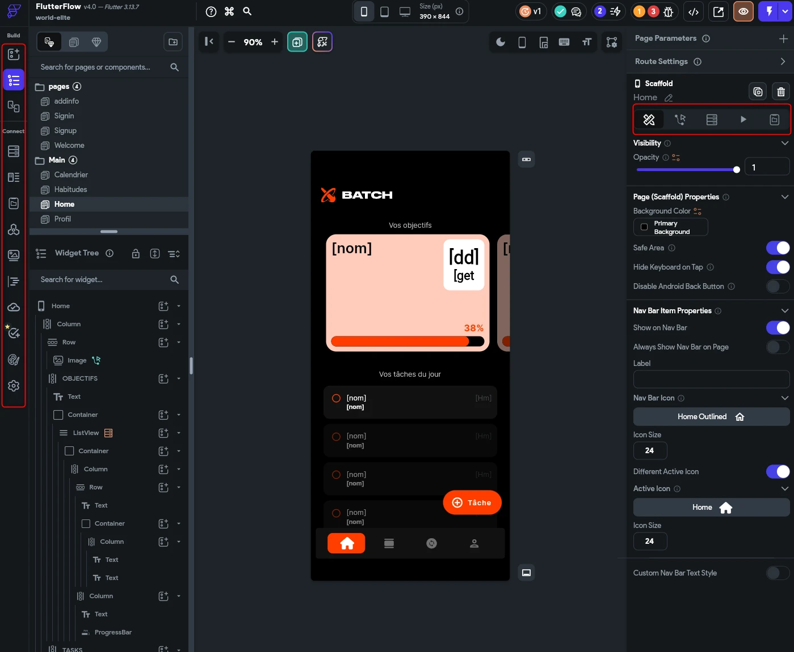
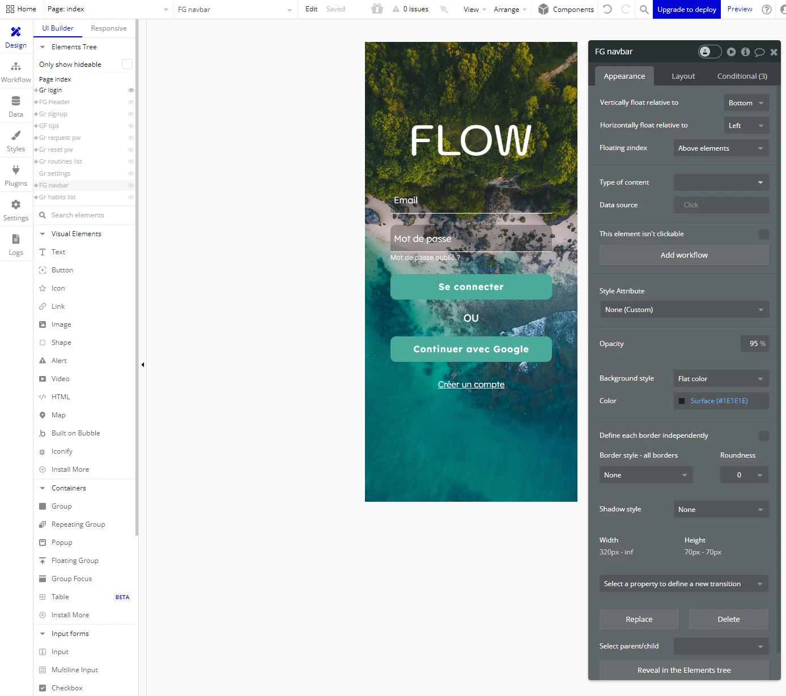
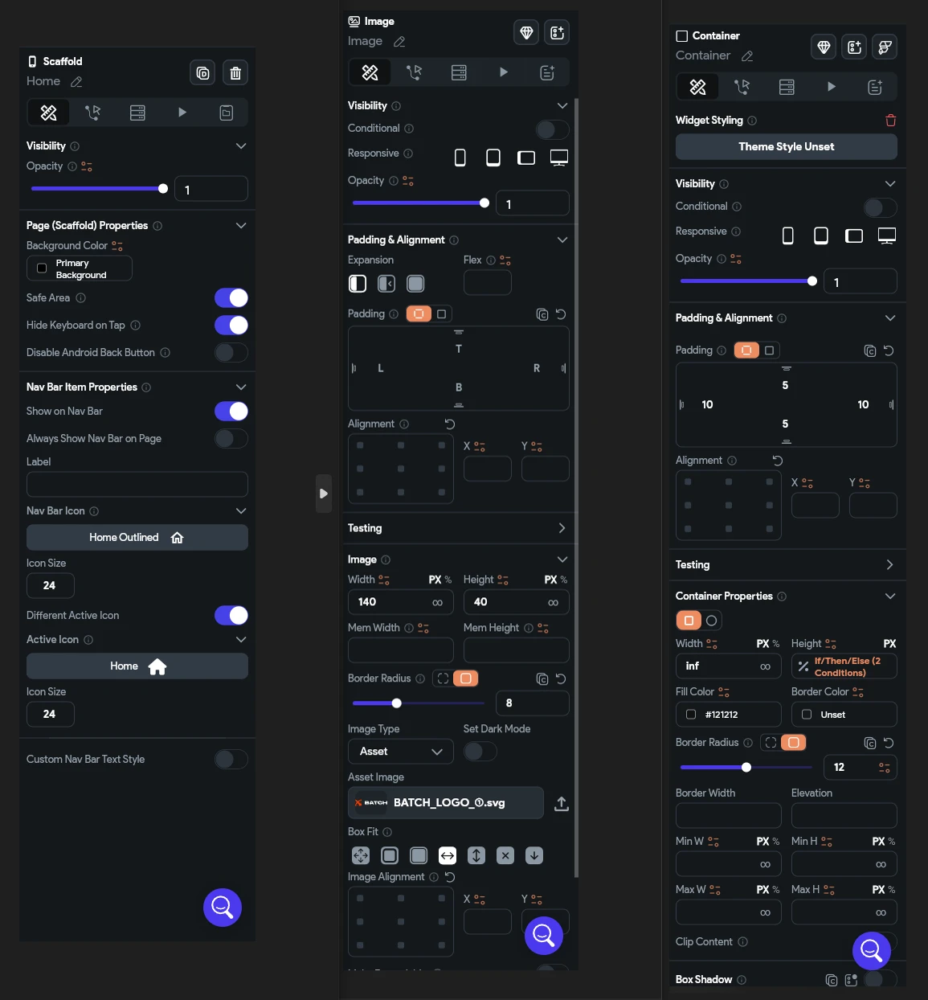
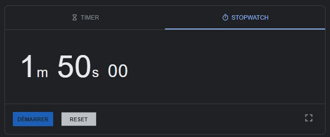
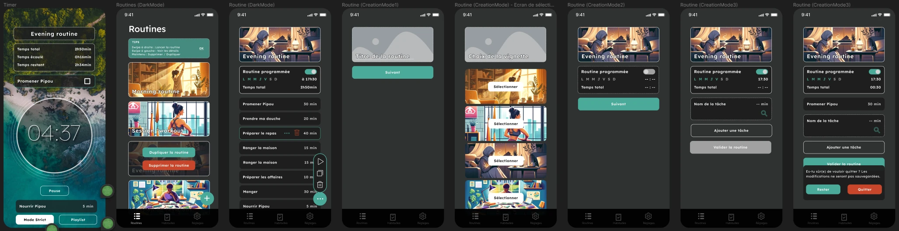

Tu te souviens de mon planning de la première semaine de Décembre ? Attends, je te rafraîchis la mémoire :

FORMATION FLUTTERFLOW !!!

Oui j’étais en retard sur cette formation et j’avais l’intention de rattraper mon retard. Alors j’ai péniblement fait une session d’1h30 lundi soir. Et puis mardi et mercredi, je n’ai rien fait, semaine un peu compliquée, un peu stressée par mon passage au bloc prévue jeudi. Au passage, tout s’est très bien passé et je suis à présent libérée d’un organe qui ne m’étais plus utile… je t’imagines froncer tes sourcils d’ici et NON, ce n’est pas ce que tu crois ! 😅 Bref ! je m’égare…

Les jours qui ont suivi, je n’étais pas très apte à rester devant mon PC pour ma formation donc j’ai entamé la lecture de “How to build a Billion Dollar App” de George Berkowski. Il donne la recette pour construire une application qui va cartonner de manière planétaire ou en tout cas, il analyse ce que les créateurs d’applis “à 1 milliard” comme Instagram, Square ou Snapchat (entre autres) ont en commun. Et, c’est peu de le dire, je n’ai pas grand chose en commun avec eux 😅

- La majorité d’entre eux ont fréquenté une université de grande renommée (Stanford, Harvard, Berkeley…) pendant que moi j’empruntais la filière BEP > BAC Pro > BTS…
- Ils ont commencé à se faire un réseau de connaissances dans ces mêmes universités pendant que moi je me faisais harceler par mes camarades (trop moche, trop intello, trop bizarre… ils avaient bcp d’imagination!). Autant te dire que je n’ai gardé aucune relation de cette période là ^^
- Sur 43 de ces boîtes, 27 se sont fondées à San Francisco. En 2e position, on retrouve New-York avec 3 boîtes seulement. Un peu loin de ma Provence natale XD

Bref, on pourrait dire que ça part mal pour moi, mais en vérité, ça tombe bien, je n’ai absolument pas l’ambition de construire une app à 1 milliard de dollars ! Alors je vais terminer de lire ce livre, parce qu’il est bourré de bons conseils, mais je ne me fais pas d’illusions quant à devenir milliardaire 😂 En revanche, j’ai acheté l’E-book “Make” de Pieter Levels qui a un profil qui me paraît beaucoup mieux correspondre au mien (le nomadisme en moins ^^) et qui pour le coup m'inspire énormément !

Oui mais t’avais dis que t’abandonnais, j’comprends plus rien là !!

JAMAIS de la vie ! C’est la formation à FlutterFlow que j’abandonne parce que Bubble est largement suffisant pour ce que je veux faire actuellement. En vérité, il est même plus complet que FlutterFlow mais à la base je voulais voir les 2 outils justement pour me faire ma propre idée. Et bien, il ne m’aura pas fallu très longtemps pour trancher… J’ai trouvé la prise en main de FlutterFlow im-bu-vable ! (pour rester polie).

Autant son interface (darkmode) au premier abord m’a semblé bien plus attrayante que celle de Bubble, un peu vieillote (mais en même temps Bubble est dans la place depuis plus de 10 ans maintenant) et d’un blanc immaculé (ça casse un peu les yeux j’avoue ^^).

Autant, niveau clarté et intuitivité c’est zéro ! Des dizaines d’icônes de partout, ton cerveau est en permanence en train de se demander “attends, ça représente quoi déjà cette icône ?”, “mais il est où déjà le menu ‘machin-truc’ ?”…

Dans Bubble, tout est clair, nommé, regroupé. Le menu de paramétrage, à droite, est toujours sensiblement le même, organisé dans le même ordre.

Dans FlutterFlow, dès que tu cliques sur un élément différent, toutes les options de paramétrages changent de place, t’es tout le temps en train de loucher pour chercher même la plus basique des options.

Le fait de devoir faire les bases de données 2 fois, une fois dans Firebase, une fois dans FlutterFlow pour lier les 2, c’est d’une lourdeur ! Alors oui, c’est sensé être mieux, dans le sens où FlutterFlow se concentre sur le FrontEnd pendant que le BackEnd peut se faire sur des plateformes au choix qui sont spécialisées dans la gestion des Bases de Données. Mais même si je comprends l’argument, je n’ai pas accroché du tout.

Et alors la “preview” de l’app, on en parle ??! Non, vaut mieux pas en parler je crois…

Bordel, 1 minute 50 secondes pour charger la preview !?

Et 26 secondes pour un "**instant** reload” !?!! Non mais sérieusement ??!! j’ai une dispo de 2h maxi par soirée, je peux pas me permettre de passer une demie heure en temps de chargement hein !!!

Fiouuu ! Désolée… fallait que ça sorte…! 😅

## NON EN FAIT JE CONTINUE !

Donc voilà, le week-end dernier j’étais dans une phase un peu en demi-teinte. Je ne savais pas si je devais arrêter le module FlutterFlow, ce qui signifiait potentiellement avoir perdu environ 300€, et en quelque sorte un peu baisser les bras. Ce qui explique pourquoi tu n’as pas eu d’article Dimanche dernier, je n’avais pas vraiment les idées claires… Mais arrivé Dimanche soir, après y avoir bien réfléchi, je me suis dit que tout le temps et l’énergie que je ne mettrais pas à me forcer à terminer ce module qui commençait à m’exaspérer, je pourrais l’investir dans la suite de mes projets !! Et là, la machine est repartie !

Comme prévu, j’ai analysé les retours à mon enquête utilisateur. Je sais absolument pas quoi faire avec, mais je l’ai fait ! 😄

J’ai reboot mon PC, il en pouvait plus, et il est très content à présent.

J’ai tout paramétré mon overlay pour mes Lives Twitch, y’a plus qu’à ! Et j’avoue que j’ai du mal à me lancer parce que “introvertie” oblige… 😑

Et OUI, si tu as bien regardé la capture d’écran de Bubble, tu auras remarqué que j’ai commencé à développer mon appli !!! 😍 J’ai terminé les designs des écrans principaux :

Et j'ai commencé à construire l'appli dans Bubble ! Et alors là, je suis motivée-motivée !!

La semaine qui arrive, le programme c’est continuer le dev de “Flow”, possiblement sur Twitch, si j’arrive à appuyer sur ce foutu bouton “Commencer le streaming” ^^ Commencer la lecture du livre de Pieter Levels si je trouve un peu de temps. Et c’est déjà pas mal.

Voilà, je pense que je vais arrêter là pour le Compte-rendu. J’espère que tu ne me tiendras pas rigueur pour ce titre “racoleur” 😄 N’hésites pas à venir me donner ton avis sur ce retournement de situation en commentaire.

Et d’ici Dimanche prochain, portes-toi bien ! Peace ✌️
