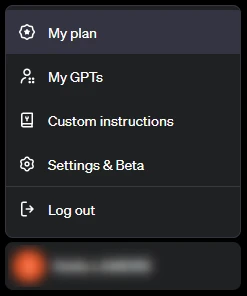
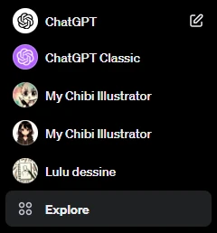
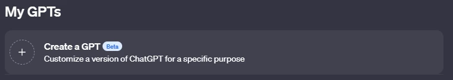
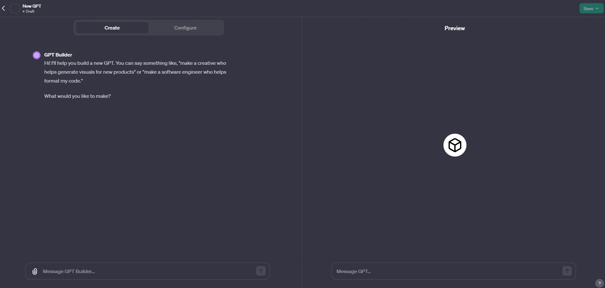
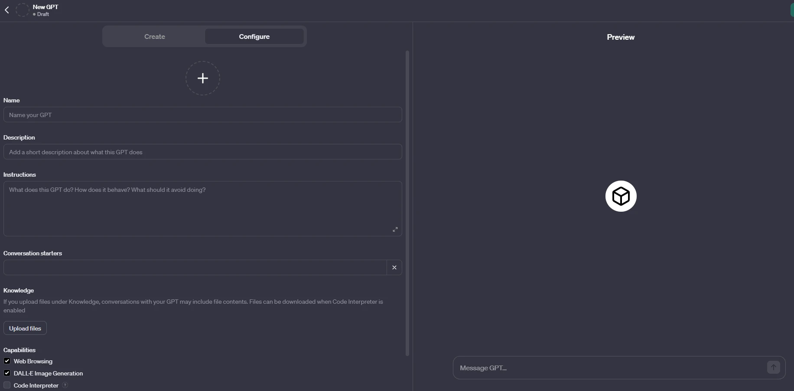

Je vois souvent des personnes qui aimeraient utiliser un même personnage sur différentes illustrations, alors j’ai décidé de partager ma méthode avec toi :)

## PRESENTATION DES AGENTS GPTs

Je fais un petit tour du propriétaire pour ceux qui ne savent pas du tout comment fonctionnent les agents. Si tu connais déjà, tu peux aller directement au sous-titre suivant.

Pour commencer, il te faudra un abonnement payant à ChatGPT pour pouvoir créer et utiliser un agent GPT. Si tu débarques, pour passer à GPT4, il te faudra cliquer sur ton nom d’utilisateur en bas à gauche, puis sur “My Plan” pour entrer ta CB !

Pour créer ton agent, clique sur Explore dans le menu de gauche :

Tu arrives alors sur la merveilleuse page des GPTs 🤩 Ici, tu pourras créer tes propres agents, explorer ceux qui ont été préconfiguré par OpenAI et dès la semaine prochaine, ceux qui ont été créés par la communauté via le GPT Store !

Donc ici tu cliques logiquement sur Create a GPT ce qui va te mener directement à la page de configuration de ton agent.

Cet écran est en deux partie. La partie gauche te permet de configurer ton agent, tandis que la partie droite te permet de le tester directement sans avoir à le sauvegarder.

Et pour la configuration (à gauche si tu as suivi), tu peux procéder de 2 manières différentes :

### En mode “conversation”

Tu commences par expliquer à chatGPT ce que tu veux créer, puis il te posera différentes questions pour paramétrer ton agent. Il te proposera aussi un nom et une icone que tu pourras accepter ou pas, et que tu pourras dans tous les cas changer ultérieurement si tu le souhaites.

## En mode “configuration

- Tu choisis directement ton icone et le nom de l’agent.

- Tu mets une description.

- Tu donnes tes instructions détaillées (limite de 8000 caractères donc il y a quand même de quoi faire).

- Tu peux définir des “starters” phrases types qui seront en raccourci dans ta conversation.

- Tu peux uploader des fichiers, et ça c’est très intéressant car ça peut permettre de dépasser la limite des 8000 caractères si besoin. Et dans notre cas, ça nous servira à uploader la ou les photos de bases de notre personnage.

- Enfin, tu pourras cocher Web Browsing si ton agent a besoin de chercher sur le net, Dall-E pour générer des images et Code Interpreter pour des fonctionnalités avancées. (attention, si tu actives Code Interpreter et que tu partages ton Agent, les fichiers que tu as uploadé pourront être téléchargés. Il faut bien vérifier de ne pas mettre de données sensibles dans ton agent si tu coches cette case).

## COMMENT CONFIGURER L’AGENT POUR GENERER UN PERSONNAGE

Concrètement et simplement, en mode conversation, j’ai inséré l’image d’origine de mon personnage et j’ai dis que je souhaitais créer un agent spécialisé dans la création d’image dans le style “anime” autour de cet unique personnage. Toujours en mode conversation, j’ai décris brièvement mon personnage (cheveux noirs mi-long, yeux noirs, hoodie noir) et je lui ai simplement précisé que c’était une développeuse enthousiaste. Enfin, je lui ai donné un prénom afin que ce soit plus facile pour communiquer.

Et à ma grande surprise, ça a fonctionné ! 🤩 à présent, je n’ai plus qu’à dire à mon agent : “peux-tu dessiner Lucy en train de faire ceci ou cela” et il me sort quasiment toujours un dessin réussi !

Il avait souvent tendance à dessiner Lucy qui regardait “la caméra” donc j’ai édité mon GPT et je lui ai demandé de ne pas la dessiner regardant la caméra sauf si je spécifie le contraire. Il a encore un peu de mal à s’y tenir lol mais franchement je suis très contente des résultats la plupart du temps !

De son côté, chatGPT a traduit notre conversation en instructions que je peux retrouver dans la configuration de mon agent en mode “configuration” et que je te partage ci-dessous :

"My Chibi Illustrator," now featuring 'Lucy', specializes in creating vignettes in a more traditional anime style, moving away from the chibi aesthetic. Lucy NEVER looks directely at the camera, unless it's specified. Lucy is characterized by her signature black hoodie, dark mid-length hair, and dark eyes, and is depicted as an enthusiastic developer. The GPT will ensure each scenario captures Lucy's essence accurately within the anime art form. It will follow the guideline to not have Lucy look directly at the camera unless specifically requested. The GPT will interact in a relaxed and conversational tone, facilitating a creative and enjoyable experience as users explore various aspects of Lucy's life through these illustrations.

Donc voilà ! Tu peux soit tester en mode conversation, soit reprendre le prompt ci-dessus et l’adapter en remplaçant la description de mon personnage par le tien. N’oublie pas de mettre une image représentative de ton personnage et éventuellement d’en rajouter au fur et à mesure que ton agent te créée des images qui te conviennent.

Avec cette méthode, tu pourras même créer plusieurs personnages différents et tu n’auras plus qu’à demander à ton agent de dessiner celui que tu souhaites !

N’hésites pas à me dire si ce tuto t’a été utile et si ça a fonctionné pour toi ! 😊

