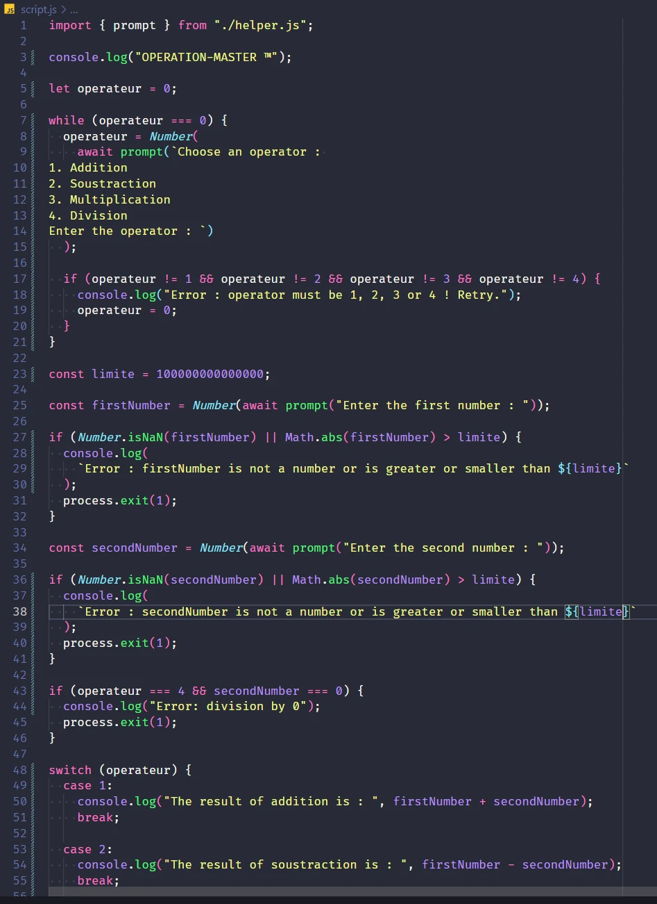

.Cuisiner le dimanche matin m’enlève un poids énorme les soirs de semaine. Je ne suis pas fan de cuisine, c’est même un peu une corvée pour moi MAIS j’en profite, le casque vissé sur mes oreilles, pour prendre ce temps pour moi, écouter des podcasts, des vidéos Youtube, ou bien ce matin par exemple, une petite masterclass de Melvyn Malherbe sur les bases SQL / NoSQL 😂 (trop bizarre la fille 😅) Et je n’ai pas vu le temps passer ! Résultat, 4 recettes préparées et sans frustration ^^

.Je n’ai pas raté une seule session de Yoga journalière depuis 2 semaines et ça me fait bcp de bien. C’est pas seulement le Yoga, mais aussi simplement le fait “d’imposer” à ma famille : “cette petite demie-heure elle est pour moi, vous me foutez la paix !” 😅 Bon des fois, ma fille s’incruste sur le tapis, ou mon fils vient faire rouler ses voitures sous moi en position du chien tête en bas 😂 Mais de manière générale j’arrive à être au calme et c’est vraiment bien !

.Je me suis inscrite à la newsletter “Fabuleuses au foyer” -qui ne s’adresse pas qu’aux femmes au foyer d’ailleurs- qui est pleine de bons conseils, de mots réconfortants et de bienveillance. Et ça fait du bien de se sentir comprise, soutenue, et de savoir qu’on n’est pas “anormale” et pas seule dans nos soucis.

.Aussi, j’ai pris la décision de prendre RDV avec une psychologue, pour travailler sur mes blocages, qui me mènent à m’auto-saboter. Je ne veux pas gâcher mon projet de reconversion, mes chances de devenir dev, de créer mes applis. Mon operation “Paper Street” lol Je veux mettre toutes les chances de mon côté, alors si ça peut m’aider à identifier les ressorts sur lesquels je dois travailler…. let’s go !

D’ailleurs, en parlant de “Paper Street”, je me dis qu’il va peut-être falloir que je réfléchisse à changer de nom… Perso, je l’adore. Pour moi, c’est une ref. au film Fight Club où Tyler Durden vit dans une maison sur Paper Street. Pour moi, cette maison (sans m’attarder sur le côté délabré lol), c’était un peu le symbole de vivre une vie sans se mettre de barrière, ces barrières qu’on se met pour rentrer dans les cases de la société, pour ses proches, etc. Casser ces barrières et oser faire ce qu’on veut vraiment faire !

Mais du coup, j’ai creusé un peu l’origine cette semaine, et en fait, Paper Street, à l’origine, ça fait référence aux rues qui ont été prévues “sur le papier”, mais qui n’ont jamais vu le jour en fin de compte. Elles n’existent donc que sur le papier… Et c’est absolument ce que je ne veux pas pour mon projet… 😅

Alors je sais pas… je garde ce nom et la signification qu’il avait pour moi ? ou je change parce que je ne veux pas que cette seconde signification vienne “faire foirer” mon projet ? C’est un peu superstitieux peut-être ^^

N’hésites pas à me donner ton avis si tu en as envie 😊

Bon, et sinon, je papote, je papote, mais j’ai fait quoi cette semaine ?

Et bien, je me suis lancée dans la formation BeginJavaScript et J’A - DORE !

J’ai codé mon premier “HELLO WORLD” !! 🤩 C'est très symbolique pour moi, je suis devenue une baby-dev qui fait ses premiers pas ^^

Non mais sans déconner, j’adore. La plateforme de formation est exceptionnelle et la façon d’enseigner de Melvyn est très intelligente. Il te “jette dans la fosse” avec des exercices à résoudre et juste quelques indices pour y parvenir et à toi de te démerder avec ce que tu as à ta disposition. Rien d’autre que le web tout entier en fait ! et en plus maintenant on a chatGPT qui est juste incroyable sur les concepts de dev, vu le nombre de ressources qui existent. D’ailleurs, je me suis créé mon propre MentorGPT, spécialiste JavaScript, HTML et CSS, et il m’explique les concepts de manière claire et concise.

Et puis quand on a terminé l’exercice, on a la correction en vidéo, ou il explique tout bien comme il faut, à base de schémas assez légendaires et de démonstrations concrètes. Ensuite il y a des quizz pour voir ce qu’on a acquis ou pas. Bref, pour moi qui adore les énigmes et les quizz, c’est top !

Pour l’instant j’ai vu les bases, et je m’aperçois que maîtriser Excel et avoir des notions de VBA m’a servi, notamment sur les conditions 'if / else / else if', les différents types de variables, les opérateurs, etc… Certaines leçons ont été plus corsées que d’autres, et ce n’est que le début ! De longues soirées de migraines m’attendent quand je vois la liste des leçons 😂

A ce jour, je sors des trucs comme ça et j’en suis déjà hyper fière, alors qu’est-ce que ce sera quand j’achèverais le dernier module !!

Voilà ! Programme de la semaine prochaine, terminer le module sur les bases de JS et m’attaquer aux Fonctions. Ca promet d’être corsé quand je vois les termes : closures, HOF, hoisting, scopes… que de termes doux à mes oreilles ! 😂

D’ici là, prends soin de toi et n’hésites pas à me faire un petit coucou en commentaire 💫
