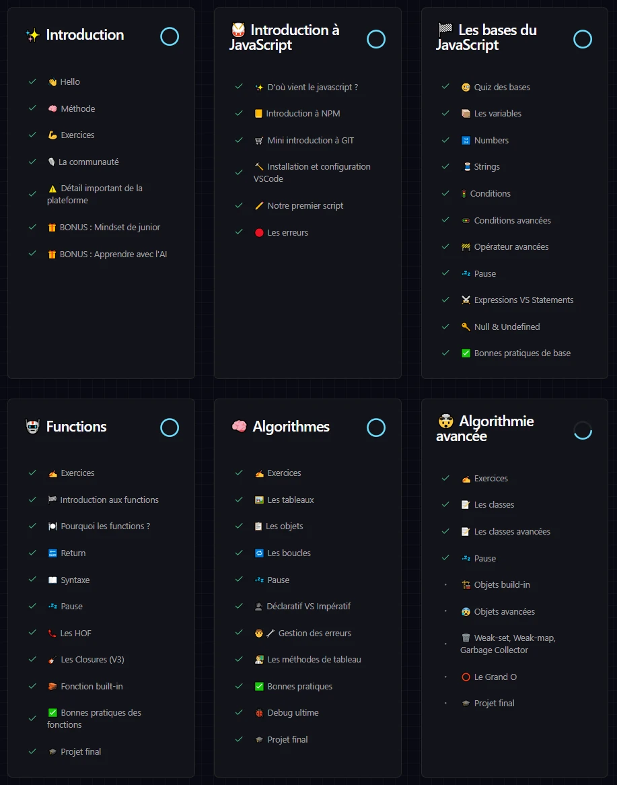

C'est loin d'être facile et pour autant, je prends beaucoup de plaisir à galérer sur les exercices et à les réussir ^^ Pas une seule journée n'est passée sans que je lance VSCode avec entrain !

Il me reste encore beaucoup de choses à voir sur JavaScript, et après ça, beaucoup d'autres choses à voir pour pouvoir me prétendre Développeuse. Et j'avoue que si j'y réfléchis trop, ça me donne le tourni ! Tous les concepts à maîtriser paraissent être une montagne gigantesque et souvent je me demande si j'y arriverais vraiment …

Alors j'essaye de ne pas trop y penser, et je me focus sur mes cours, une chose à la fois. Chaque jour, j'en sais plus que la veille, alors ça veut dire que j'avance dans le bon sens non ? 😁

Allez, je ne te garde pas plus longtemps. Je ne voulais pas te laisser plus de 2 semaines sans nouvelles mais j'ai du pain sur la planche !!

A très vite et en attendant, prend soin de toi 🌠
