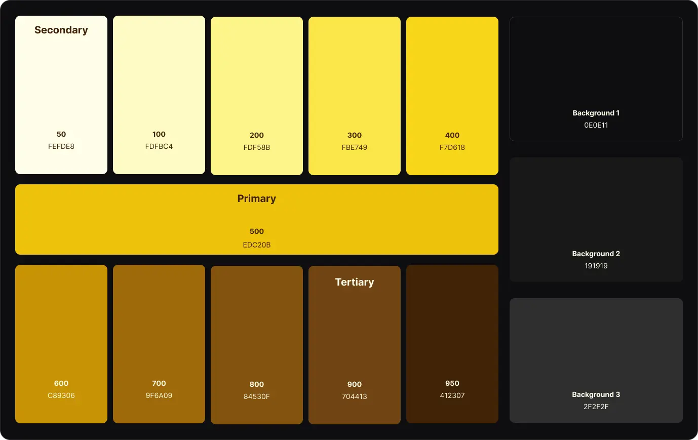
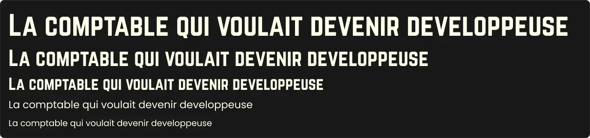
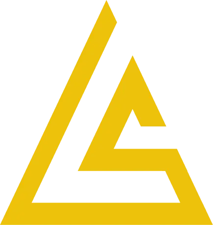
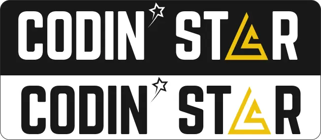
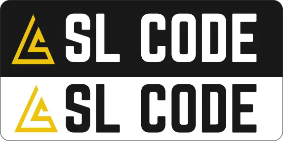

J'en oublie les formules de politesse ! 😅

Hello toi ! J'espère que tu vas bien ? Ici, ça va même si, comme tu l'as lu dans le titre, j'ai échoué dans l'objectif de ces 2 dernières semaines. J’ai commencé l’apprentissage, mais j’ai pas accroché. Je me suis dit, “allez, fait toi violence, ça va te prendre quelques heures tout au plus…”. Impossible ! Je me suis littéralement endormie devant une vidéo ! assise devant mon clavier !

Sérieusement, arrivée aux Generics, je vois ça :

```mdx
function push<T, U>(items: T[], item: U): (T | U)[] {
return [...items, item] }
```

Et je dis : “ha non! là c’est trop !” 😂

Je sais pas si c’est la formation, 100% vidéo, qui m’a fait cet effet. Mais pour moi, c’était beaucoup trop abstrait pour que mon cerveau mémorise quoi que ce soit…. J’ai lâché l’affaire… (pour l’instant 😉)

En plus, truc de fille, je suis arrivée dans ma période “critique” et j’étais vraiment low-energy… (comment ça je me cherche des excuses ? ^^)

Par contre, je me suis sentie d’humeur créative et je me suis lancée dans la refonte totale de ma marque personnelle !

J’en avais parlé dans mon article Hello World, quand j’ai creusé l’origine du nom “Paper Street”, j’ai pensé à changer car je ne voulais pas que mon projet de reconversion finisse comme ces “rues de papier” qui ne voient finalement jamais le jour. Je voulais donc trouver un nouveau nom, qui contienne le terme “code”. Je voulais aussi garder l’étoile, en référence à mon prénom, et parce que, même si je ne suis pas particulièrement superstitieuse, j’ai toujours eu l’impression d’avoir une “bonne étoile”. Et en prenant ma douche… j’ai pensé à Coding Star : “l’étoile qui code” !

J’ai trouvé mon idée géniale (lol) et je suis partie dans la création de l’identité visuelle.

## IDENTITE VISUELLE

**Les couleurs**

- du noir (ou gris très sombre) parce que je suis team Dark Mode et que les couleurs de ce blog me font mal aux yeux la nuit xD
- du blanc pour contraster, pour les textes etc…
- du jaune vif en couleur primaire, une couleur dynamique et qui symbolise bien les étoiles



**Les polices **

- J’ai gardé Norwester, car je la trouve moderne et facile à lire et j’aime bien les lettres capitales avec la différence entre les majuscules et les minuscules

- Pour le reste, j’ai opté pour Inter, classique mais agréable à lire



**Le logo et le nom**

A la base, je partais donc sur Coding Star, et je voulais mettre une étoile à la place du A. Mais j’ai finalement trouvé que ce n’était pas assez lisible. J’ai opté pour un triangle à la place du A qui serait également le logo principal.



J’ai trouvé cette idée sympa, avec le S pour Stella et le L pour mon nom de famille, mais aussi le L qui symbolise mon pseudo, Lucy, que j’utilise en ligne depuis des années, et qui m’est très cher. Lucy, c’est un peu justement la partie ultra geek de moi, que les gens qui me connaissent peu n’imaginent pas. Et qui peut s’exprimer à 100% quand elle code pendant des heures ou qu’elle geek beaucoup trop tard 😅

Et j’avais mis une petite étoile en terme d’apostrophe pour donner Codin’ Star :



J’aimais franchement beaucoup. (je l’ai montré à une amie qui à un peu la fibre “design”, elle m’a dit : “c’est pas ouf” 😅 ) Mais en y réfléchissant, j’étais pas à l’aise avec le “Star”, pas envie de donner l’impression que je me la pète en mode “star du code”, c’était pas le but… Et puis le A en logo, c’est pas super lisible au final…

Bref, j’ai ramené un peu de sobriété dans tout ça et je suis tombée d’accord avec moi-même pour cette version finale :



Voilà, simple mais efficace (enfin je trouve ^^)

## BON ET L’APPRENTISSAGE DU CODE DANS TOUT CA ?

Après cette petite phase créative, j’ai cherché des petits projets/exercices à coder en JavaScript, pour pratiquer un peu et apprendre de nouvelles choses.

Genre :

- créer une petite appli de chat avec Express.js et socket.IO
- construire un Email Sender
- créer un projet avec gestion de l’authentification pour apprendre l’aspect gestion des utilisateurs
- créer une extension chrome

Alors j’ai créé mon petit chat qui fonctionnait très bien jusqu’à la dernière phase de l’exercice où… j’ai tout cassé ! 😅 Et j’ai eu la flemme de me prendre la tête à chercher une solution, ou plutôt, j’avais pas envie de perdre mon temps.

Et je me suis dit… (oui je sais, je me dit beaucoup de choses… mais tu commences à comprendre, je suis pas toute seule dans ma tête 😂). Je me suis dit donc, que ce serait beaucoup plus intéressant d’intégrer ce genre d’apprentissage dans de VRAIS projets. Quelque chose que j’aurais vraiment envie de réaliser pour pouvoir passer du temps à apprendre tout en réalisant quelque chose de concret. Comme ça j’optimise mon temps !

Alors quel est ce projet qui pourrait contenir toutes ces fonctionnalités ?…. Mon NOUVEAU blog !! 🤩 Eh oui, l’article que tu lis actuellement est probablement le dernier (l’avant-dernier) que tu liras ici, sur Framer, avant le reveal de mon tout nouveau blog et je préfère te prévenir … non en fait, c’est juste un blog, mais moi j’ai appris teeeeellement de nouvelles choses en le codant ! Je suis trop trop contente ! Je vais même pouvoir faire un article pour expliquer ce que j’ai utilisé et comment ça marche, je suis JOIE ! (trop d’enthousiasme en moi, désolée ^^)

## ET LA ROAD MAP ALORS ?

Oui, c’est vrai, je disais la semaine dernière qu’il était important de suivre un plan de formation quand on se reconvertit en autodidacte. C’**est** important.

Mais il faut savoir discerner les sujets qui sont impératifs à connaître avant d’autres et ceux qui peuvent être différés. C’est le cas pour TypeScript. Oui, ça serait bien que j’apprenne les bases de TS avant d’attaquer React, mais ce n’est pas indispensable. Je vais chercher un autre support d’apprentissage qui me correspondra peut-être mieux.

Il faut savoir aussi suivre son “rythme d’énergie”. J’en parlais en décembre, en tant que femme, nos niveaux d’énergies diffèrent beaucoup selon la période du mois. En tant que parent, ça fluctue aussi beaucoup en fonction des “contraintes” parentales. Et en tant qu’humain, tout simplement, on n’est pas au top, tout le temps, et c’est normal. L’important étant d’avancer, d’être un peu meilleure chaque jour et de garder le cap.

Donc l’objectif pour les 2 prochaines semaines (normalement 😅), c’est de terminer mon blog pour vous le dévoiler et d’y ajouter des fonctionnalités en plus (chat, gestion de la newsletter, etc…) histoire d’apprendre et de progresser encore 🔥

Voilà, ce post est déjà bien assez long je pense alors je te dis à très vite et, en attendant, porte toi bien ! 💫
