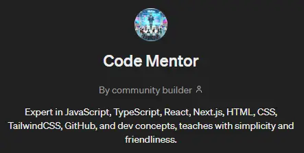

Alors, t’en penses quoi ?! Perso, je suis pas fan du light mode. Je sais pas comment faire moins blanc, mais que ça reste joli. J’y travaillerai à l’occasion. Par contre, le dark mode, je l’adore 😍

## COMMENT J’AI CREE MON BLOG

Alors au risque de te décevoir, j’ai commencé par suivre un tuto… oui, je sais ce que tu penses : _“trop nul, en fait elle a rien fait quoi ! “_

Mais détrompe toi ^^ Oui, j’ai suivi un tuto très bien fait sur la chaîne de Jolly Coding. Pendant 4 soirées, j’ai suivi pas à pas les instructions, en prenant soin de comprendre un minimum ce que je faisais. Eh oui, le blog est en React et Next, et je ne suis pas encore formée. Pour autant, grâce à la formation BeginJavaScript que j’ai suivie, et à sa petite introduction à React, j’étais pas totalement perdue.

Si j’ai choisi ce tuto, c’est parce qu’on m’avait parlé d’utiliser des fichiers Markdown pour gérer les posts et j’ai tout de suite accroché à l’idée. Simple mais efficace, on peut créer un article en quelques secondes, faire la mise en forme à la volée, et publier avec un simple “commit”. Ca faisait quelques temps que je cherchais comment créer mon propre CMS, et voilà que la personne me donne le lien vers le repo github de Jolly Coding. J'ouvre la vidéo YouTube et ni une ni deux, je me lance ! 🚀

Mettre en application tout ce que j’ai vu dans ce tuto, m’a permis de comprendre comment créer et utiliser un composant React. Et suite à ces 4 sessions de copie pure et simple, j’ai pu créer moi-même plusieurs autres composants et les intégrer à mon blog. J’ai pu customiser le thème dark, les polices, etc…

Mais c’est pas tout ! J’ai appris à utiliser shadcnUi et Zod pour créer le formulaire d’abonnement à mon blog (que tu n’oublieras pas de remplir bien sûr 😉) et valider les champs avant l’envoi. Plutôt easy cette partie.

Mais ensuite, je me suis cassé les dents toute une après-midi sur Resend ! pour configurer l’envoi d’un mail lors d’un nouvel abonnement ! 4 heures !! juste pour ça ! Parce que les documentations, c’est bien hein… mais alors c’est vraiment pas explicite pour les débutants ! 😲

**Etape 1** : installer resend

```tsx
pnpm add resend

```

Easy !

**Etape 2** : créer le composant “email template”

```tsx
import * as React from "react";

interface EmailTemplateProps {
  firstName: string;
}

export const EmailTemplate: React.FC<Readonly<EmailTemplateProps>> = ({
  firstName,
}) => (
  <div>
    <h1>Welcome, {firstName}!</h1>
  </div>
);
```

Easy aussi, j’ai juste à personnaliser mon texte et c’est good !

**Etape 3** : envoyer l’email

C’est là que ça se corse ! Déjà, il faut choisir entre deux méthodes selon si on utilise Pages Router ou App Router… heeuuu… nanni ??! 🤔

Tu cliques sur Pages Router pour voir ce que c’est :

> _API routes provide a solution to build a **public API** with Next.js.
> Any file inside the folder `pages/api` is mapped to `/api/_` and will be treated as an API endpoint instead of a `page`. They are server-side only bundles and won't increase your client-side bundle size.\*

heu ok ? 😅

Puis tu cliques sur App Router :

> _Route Handlers allow you to create custom request handlers for a given route using the Web [Request](https://developer.mozilla.org/docs/Web/API/Request) and [Response](https://developer.mozilla.org/docs/Web/API/Response) APIs._

Me voilà bien avancée… 😂

En regardant la structure de mon blog, je vois que j’ai un dossier **app**, mais pas de dossier **pages**. J’en conclus donc que je dois utiliser la 2e solution ?! 🤷‍♀️

Je me pète les dents plusieurs heures sur cette solution, sans succès, je baisse les bras… Je tente la seconde solution. En suivant uniquement la doc de Resend, aucune chance que je réussisse à mettre en place l’envoi des mails. J’ai dû m’aider de mon fidèle mentor et assistant, mon customGPT spécialisé :



Et enfin, 4 heures et 1 million de tests plus tard, ça FONCTIONNE !! 🤯 🥳 Et cette sensation d’accomplissement, c’est juste **ULTIME** 😄 Je pense que les devs sont drogués à cette sensation et que c'est pour ça qu'ils acceptent de passer des heures à galérer sur de nouveaux défis 🤣

Après ça, j’ai passé quelques heures à customiser mes mails, recréer tous mes anciens articles dans des fichiers Markdown, et **enfin** mon blog était prêt 😍

Et comme je suis un peu “fadade” comme on dit par chez moi, j’ai tenu à créer une petite “animation” de fondu au noir pour la transition entre l’ancien et le nouveau blog et ça m’a pris… une après-midi de plus 😂

Ce qui a été compliqué, ce n’est pas spécialement la mise en place, mais de trouver quelle solution utiliser ! Encore une fois, il semble qu’il y ait pas mal de façons de faire (utiliser `<style>` dans le HTML du composant, utiliser useEffect/useState, etc…) mais je n’ai réussi à implémenter aucune de ces solutions… Je ne suis clairement pas assez expérimentée pour utiliser les useState et/ou mon Code Mentor me dit parfois de la merde ?! Toutes mes recherches Google n’ont rien donné…

Jusqu’à ce que je réalise que je pouvais utiliser des variables dans le HTML en utilisant des accolades (je le savais déjà mais j’avais oublié lol) Et donc, un simple script en JavaScript a fait le café en quelques minutes…. Hé oui, c’est aussi ça être dev ! Trouver quelle solution implémenter, en fonction du contexte, des possibilités, des compétences, etc.

Donc **OUI**, j’ai suivi un tuto pour créer mon blog, mais je n’ai pas fait que ça !

J’ai appris à :

- créer et utiliser un composant React
- utiliser Velite pour gérer mes posts au format Markdown
- utiliser Next pour le SEO, les routes…
- utiliser shadcnUi et Zod pour créer un formulaire sûr
- utiliser Resend avec son API

Il y a tout juste 3 mois, je ne connaissais pas tout ça, et je ne connaissais pas non plus HTML, CSS, JavaScript, le DOM, Tailwind, les API, VSCode, Github, ….

Et c’est pour tout ça que je suis fière de ce que j’ai réalisé ^^ C’est pas grand chose pour certains, mais pour moi, c’est beaucoup de choses supplémentaires apprises en une semaine ! Et toutes ces choses que j’ai galéré à faire, vont me servir lors de la formation BeginReact que je vais bientôt pouvoir commencer 🤩

L’objectif de la semaine prochaine est de revenir analyser la structure de mon blog pour bien comprendre tout ce qu’il a fallu mettre en place et créer un article détaillé sur le sujet ! Savoir expliquer quelque chose prouve qu’on a bien assimilé le concept, c’est un très bon exercice ^^

Voilà, n’hésites pas à me dire ce que tu penses de cet article et de ce nouveau blog en m’envoyant un mail sur ma vieille adresse mail qu’il faudra que je change à l’occasion ^^

paperstreet.notion@gmail.com

En attendant, je te dis à très bientôt et prend soin de toi ! 💫
