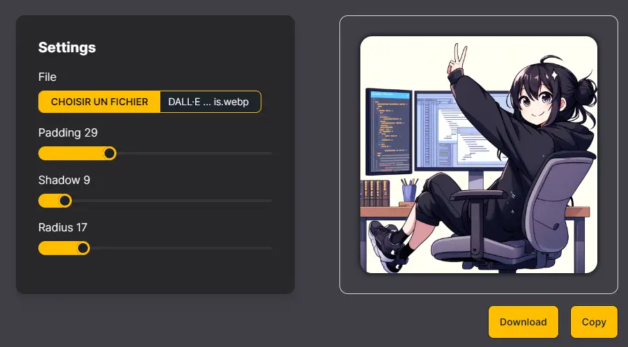
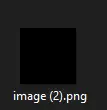
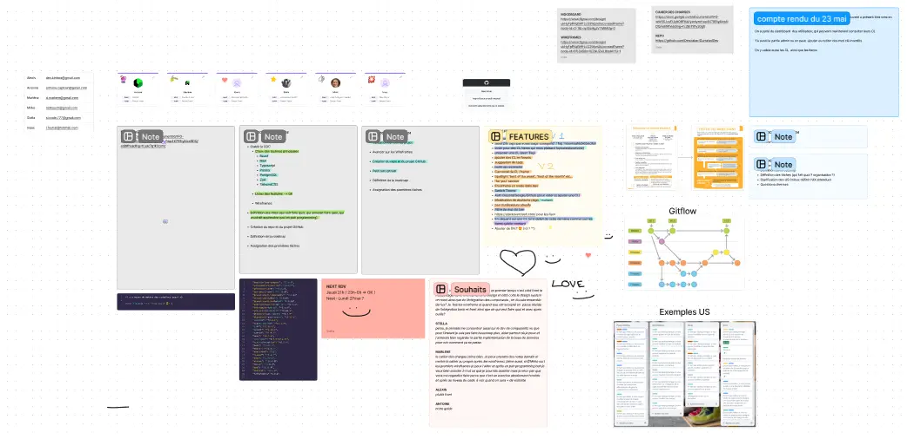

Pas beaucoup d’avancement dans ma formation, ou du moins pas autant que je le voudrais. Il y a eu 3 semaines de vacances pour mes enfants. Pour qu’ils se lèvent pas à l’aurore, on les couchait plus tard, Donc bye bye les sessions du soir ! C’est très frustrant, et en même temps, c’est la vie de parent ^^ Et il va falloir que je me fasse une raison car bientôt ce sera les vacances d’été 😅

## MES INCROYABLES TALENTS DE BABY DEV (ou pas!)

J’ai quand même pu entamer ma formation React avec beaucoup d’enthousiasme. Le fait d’avoir déjà vu quelques notions grâce au développement de mon blog et du Challenge Wordle m’a beaucoup aidé sur les premiers modules. Jusqu’à ce que je me heurte à l’exercice **démoniaque** de fin de module 3 sur les “useState”, et là c’est le drame 😂

Le but de l’exercice, créer un petit outil permettant d’uploader une image, d’y ajouter quelques paramètres grâce à des “sliders” (ajouter une ombre, des angles arrondis, etc…), puis de pouvoir télécharger l’image modifiée. Easy non ?

J’ai fait les 2 premières parties de l’exercice “finger in the nose”, ultra satisfaisant pour mon égo de baby dev… mais arrivée sur la dernière partie, où je devais “connecter” mon code avec le fichier fourni pour convertir et télécharger mon image, impossible d’aboutir au résultat attendu. J’ai passé 3 grosses sessions à refactoriser, tenter diverses solutions, regarder la correction pour essayer d’adapter mon code… le mieux que j’ai réussi à obtenir comme résultat c’est ça :

Oui, une image vide… Et c’est déjà beau par rapport à toutes les erreurs que j’ai pu avoir avant ça mais… ça reste bien frustrant d’en rester là 😅 (je me vengerais quand j’aurais acquis plus d’expérience !! 😡)

## UN PROJET PROMETTEUR

A côté de ça, je me suis lancée dans un projet de site web avec 5 autres membres des formations de Melvyn. On a constitué une équipe pour coder ensemble un site qui proposera de regrouper en un seul endroit les “curated lists” de tous les développeurs. Pour ceux qui ne connaissent pas le principe, une “curated list” c’est une sorte de sélection des meilleurs “trucs” dans un domaine. Certains devs créent leur liste des “meilleurs librairies frontend” par exemple, ou “les meilleurs tools pour générer une palette de couleur”. Mais toutes ces listes se retrouvent éparpillées un peu partout sur le web. Le but de notre site serait d’en faire l’endroit de référence pour publier ce genre de liste et ainsi pouvoir ensuite être au courant des outils/librairies/ressources les plus utiles en fonction de chaque domaine du dev.

Pour l’instant, on en est juste à la mise en place du projet. Eh oui, avant de se lancer dans le codage de l’app, il y a beaucoup de choses à discuter et à mettre en place. User Stories, liste des features du MVP et des versions ultérieures, cahier des charges, wireframes, etc… Beaucoup de choses donc, et pour ce faire, on fait un vocal ensemble sur Discord pour discuter et s’accorder sur tout ça. Antoine, à seulement 22 ans, est le plus expérimenté de nous tous en terme de gestion de projet, et a donc pris le rôle de “tech lead”. C’est lui qui dirige les réunions et qui nous guide sur le process de création d’une app. Alexis, Marlène, Mirko, Isaac et moi formons le reste de l’équipe, très motivés et enthousiastes à l’idée de construire quelque chose de stylé tous ensemble.

Petit aperçu du fichier FigJam qui nous permet de cadrer nos réunions en vocal :

Donc 2 soirs par semaine sont désormais consacrés à ce projet d’équipe. Bien que ça “retarde” un peu l’avancée dans ma formation, je suis persuadée que j’ai beaucoup à apprendre justement à faire partie de cette équipe.

## DES RÊVES PLEIN LA TÊTE

Je te le disais en début de post, j’ai la tête qui bouillonne. J’ai envie de me lancer à créer du contenu sur X (je parle bien de Twitter hein 😅), mais aussi et surtout sur YouTube.

Dans l’idée, ce serait proposer du contenu à destination des personnes qui débarquent à peine dans le monde du dev et qui sont, comme je l’ai été il y a quelques mois, ensevelis sous une avalanche d’infos et de questions. Le but serait de leur donner les ressources que j’ai mis un certain temps à découvrir, les définitions des concepts de bases qui sont vraiment obscurs quand on ne vient pas de cet univers, les réponses aux questions un peu “bêtes” qu’on se pose quand on arrive et qui semblent tellement basiques qu’on n’ose pas les poser.

En même temps, je suis en train de me relire et je me dis "non mais pour qui tu te prends ? Et en plus, tu penses vraiment que tu as du temps pour ça ??"...

C'est très vrai... Ecriture/tournage/montage/partage... ça prend un temps monstrueux. A moins de me creuser la tête à trouver un format qui se prête à un montage minimaliste...?

Et est-ce que je suis vraiment légitime à donner des conseils ? peut-être pas. Mais par contre :

- des retours d'expérience en tant qu'apprenante en reconversion
- des partages de ressources utiles
- des éclaircissements sur les termes du dev
- des petites astuces

Pourquoi pas ?

J'ai déjà écris un premier article et je l'aime beaucoup. Il est déclinable en article de blog, en thread twitter et en vidéo YT. Mais il faudrait que je puisse faire assez de contenu à l'avance pour ne pas me retrouver sans rien à publier régulièrement. Et la difficulté supplémentaire c'est de trouver un concept qui soit sympa mais pas trop long à réaliser...

Bref, je suis désolée si je te soule un peu ! Le but de ce blog c'est de mettre mes pensées "sur le papier", telles qu'elles arrivent et tu vois qu'en ce moment c'est un peu le bordel 😂

Enfin voilà à quoi rêve mon cerveau ces derniers temps quand il n’est pas en train de se fracasser contre les nouveaux concepts que j’aborde en React 😂

Bon, je pense que je t’ai suffisamment monopolisé avec mes états d’âmes pour cette semaine ! N’hésite pas à me dire par si tu trouves que c’est une bonne idée de créer du contenu pour les aspirants devs, ou si tu aimerais venir me voir en live sur Twitch.

Je te tiens au courant de la suite. En attendant porte toi bien ! Peace 💫
