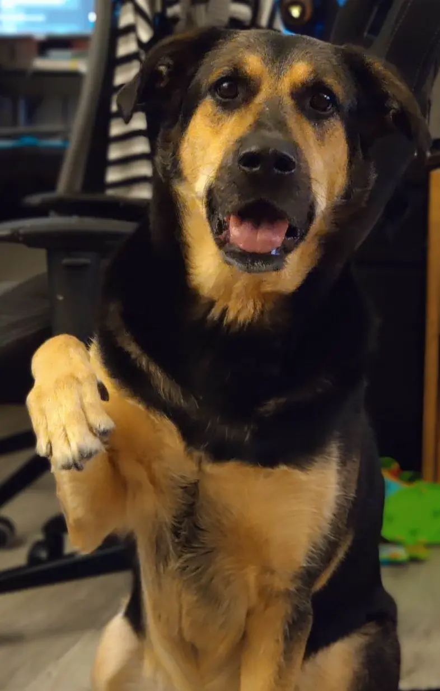

J’ai pas mal hésité à publier ce texte ici. Mais puisque ça fait partie de mon parcours et de mon contexte, j’ai eu envie de le poster, pour que je puisse me souvenir des conditions dans lesquelles j'ai entrepris cette reconversion.

Alors voilà, lundi soir, après une journée plus ou moins égale à d’habitude, j’ai récupéré mes enfants à l’école et je suis rentrée chez moi. Ma pépette de 3 ans a un petit “accident pipi culotte”. Je la rassure et pendant que je la mets sur les toilettes et nettoie le sol, je raconte à mon mari le regard noir que m’a lancé mon patron alors que je revenais d’un aller-retour éclair à l’école. J’ai dû m’y rendre exceptionnellement à l’heure du repas car l’infirmière n’a pas pu y aller pour leur faire leur dose d’insuline. Mes deux enfants sont diabétiques. Et pendant que je raconte à mon mari ce regard noir qui m’a transpercé, mon ton commence à monter alors que je digresse sur les comportements problématiques de ma collègue et puis je redescends, je reprends mon calme et j’essaye de retrouver un semblant de bonne humeur.

Mais 20 minutes et un désaccord sur une broutille plus tard, je sens que c’est trop pour moi et je pars m’isoler dans notre chambre. Je ferme la porte. Un peu fort. Et mon mari de me signifier que je n’ai pas à m’en prendre à lui alors qu’au travail je dis rien (ouais je suis comme ça moi, la bonne poire de service, et j’en suis pas spécialement fière…).

Mais là c’était la goutte, j’ai explosé, j’ai hurlé, j’ai pleuré et je me suis effondrée, épuisée. (Mon mari est tout de suite venu pour m’épauler et tenter de me consoler comme il a pu).

Mardi je n’ai pas travaillé, comme d’habitude, car le mardi je garde mon fils de 5 ans, qui est autiste. Il n’a que 3 jours d’école par semaine.

Aujourd’hui on est mercredi. Je ne suis pas allée bosser. J'ai juste pas la force…

Tu te dis peut-être _“wow, quelle chose fragile, un regard qui lui plaît pas et elle s’effondre !”..._

Alors laisse moi te raconter mon quotidien.

### MON QUOTIDIEN C’EST :

- être réveillée entre 1 et 4 fois par nuit par les sonneries des capteurs de mes petits. Il faut se lever et aller gérer les hypos ou hyperglycémies.
- Quand c’est pas les sonneries, ça peut être un petit cauchemar classique, ou alors les insomnies de mon fils. C’est assez courant, les personnes autistes peuvent avoir des troubles du sommeil. ( “par chance”, c’est moins fréquent maintenant qu’il est diabétique puisque ça le fatigue plus… mon petit chat 😭)
- Me lever donc à 6h ensuite, déjà fatiguée par une nuit peu reposante, prendre un café au calme
- Réveiller et préparer mes 2 petits pour qu’ils soient prêts à partir à 8h. Et là, c’est déjà éprouvant, il faut gérer les glycémies, calculer les glucides et faire les bolus d'insuline.
- Respecter les rituels de mon fils au risque de déclencher une crise (ce qui inclue de le porter de son lit à sa table. Il pèse 20 kg). Des fois, il change de rituel, mais comme il ne sait pas très bien parler, je dois deviner ce qu’il veut, ou ne veut pas. Quand je devine pas, il crie.
- Négocier avec ma fille parce qu’elle ne pense qu’à jouer et est adorablement têtue 😅
- Préparer les cartables et ne SURTOUT pas oublier les capteurs de glycémies sinon je suis bonne pour faire un aller-retour
- Descendre à la voiture en subissant les tocs de mon fils dans les escaliers (2 étages à descendre, mais ça peut prendre du temps, et gare à moi si je commence à m’impatienter, ça le stresse encore plus et ça part en crise…)
- Arrivée à l’école, quand j’arrive à l’ouverture (ça m’arrive), il est 8h20 (je commence à 8h30).
- Je dépose ma fille dans sa classe, je vérifie sa glycémie, j’ajuste son insuline si nécessaire, je n’oublie pas de verrouiller sa pompe. Elle me montre toutes les lettres de son prénom, un bisou puis elle rentre dans sa classe sans bouder quand elle est de bonne humeur.
- Je me dirige vers la classe de mon fils mais je dois le porter, ça fait partie de son rituel. (Les personnes autistes ont besoin de rituels, surtout pendant une transition, partir de la maison, arriver à l’école, etc…).
- Je le porte jusqu’à l’autre bout de l’école. Il pèse toujours 20 kg 😅.
- Je le dépose, je vérifie sa glycémie, j’ajuste son insuline, je verrouille sa pompe. J’échange quelques mots avec son AESH quand elle est déjà arrivée.
- J’ai de la chance, depuis quelques semaines il ne crise plus quand je le dépose devant sa classe. Avant ça, depuis la rentrée, c’était assez spectaculaire et très éprouvant pour lui mais aussi pour moi, qui suis hypersensible.
- Je sors de l’école il est déjà 8h35 et je suis déjà en retard.
- 8h40 j’arrive au travail. Oui, tous les jours, je suis en retard de **minimum** 10 minutes (ça c’est quand tout s’est bien passé).
- Malgré le marathon qu’ont été les 2h qui ont précédé, je reste souriante et professionnelle. Je mets mes problèmes perso de côté.

### MAIS MON QUOTIDIEN C’EST AUSSI :

- Gérer un planning de ministre, rempli de RDV médicaux, de réunions et de trucs à pas oublier
- Etre inquiète pour la santé de mes enfants quand leur glycémie fait le yoyo
- Trouver des solutions en cas d’absence d’AESH ou de grève à l’école (très fréquentes les grèves)
- N’avoir personne pour nous garder les petits. **JAMAIS**. (en 5 ans on a eu, une soirée ciné, et 2 après-midi à tout casser. Ha et notre nuit de noce aussi, mais à ce moment-là, ils n'étaient pas encore diabétiques. )
- Stresser pour les voisins du dessous (un enfant autiste aime beaucoup taper des pieds et faire tomber des objets 😭)
- S'excuser lorsqu'ils montent se plaindre du bruit...
- Calculer les glucides des recettes que je prépare
- Calculer les glucides que je sers dans les assiettes de mes enfants
- Ne pas oublier de leur faire les bolus à chaque repas
- Leur changer les cathéter tous les 2 jours
- Passer 30 minutes à la pharmacie toutes les 2 semaines pour récupérer toutes leurs ordonnances
- Gérer les arrachages accidentels de cathéter ou de capteur
- Changer les couches de mon fils qui n’a pas encore acquis la propreté
- Me déplacer parfois à l’école ou au jardin d’enfants lorsqu’ils sont trop hauts ou trop bas et que les infirmières ne sont pas dispos (pendant mon temps de travail)
- Remplir des dossiers MDPH, hyper longs, pour au final obtenir que le strict minimum. (et même ce qui est obtenu n’est pas mis en place par manque d’AESH et de place en structures spécialisées…)
- Avoir affaire parfois à des professionnels de santé très très cons
- Des disputes idiotes avec mon mari parce qu’on est tous les deux fatigués
- Etre interrompue toutes les 5 minutes par au choix :
  - ma fille qui m’appelle
  - mon fils que me tire par la main
  - mon fils qui crie
  - les deux qui se crient dessus
  - l’un des deux qui s’est fait mal
  - les capteurs de glycémie qui sonnent (hyper / hypo)
  - et ce, quelle que soit mon activité. Un truc chiant comme vider le lave vaisselle, plier le linge, passer l’aspi, faire la cuisine. Ce qui en résulte donc, c’est que ces trucs déjà chiants à la base me prennent encore plus de temps.
    Ou bien un truc que j’aime faire, comme coder, regarder une vidéo sur YouTube, jouer à un jeu (ah non, c’est vrai que depuis que j’ai commencé à coder, j’ai plus le temps de jouer 😅). Ce qui est extrêmement frustrant.
- M’apercevoir que j’ai oublié de donner du sucré à l’un de mes enfants en hypo depuis 10 minutes parce que j’ai été interrompue dans mon élan par X ou Y
- Au final, n’avoir que peu de temps libre pour moi, à partir de 21h, heure à laquelle je ne suis plus vraiment opérationnelle…

### ET LE BOULOT, ON EN PARLE ?

Au final, tu te dis, quand j’arrive au bureau, où je suis quasi seule avec ma collègue et mon directeur, ça pourrait être un peu “reposant”. Du calme, de la sérénité… Mais pas du tout !

Sollicitée H24 par ma collègue pour qui le moindre copier/coller est une épreuve (30 ans de carrière administrative quand même !).

Sollicitée par mes collègues sur site pour les aider sur un logiciel qu’elles pratiquent depuis au moins 3 ans de plus que moi.

Prise à partie par mon employeur qui trouve que mes retards sont inadmissibles et que je ne m’implique pas assez dans “la vie de la société” ( ⁉️ ).

Alors qu’à côté, quand il a réalisé que sa chère collègue lui volait littéralement une journée par mois (à 350 € net de sa poche la journée), il a fait sa tête de choqué-déçu mais il ne lui en a jamais parlé…

Pareil quand il a su qu’elle avait piqué une sieste pendant son temps de travail et prise en flag par un salarié… **Directrice Administrative** quand même hein !!

Je te passe ses heures passées au tel pour des appels perso non nécessaires, leurs pauses clopes à n’en plus finir, les congés posés la veille pour le lendemain (congés qu’elle oublie souvent de décompter dans ses tableaux de suivi).

Par contre je suis en permanence jugée par les deux pour mes absences quand mes petits sont malades, quand l’école est en grève, ou quand je dois me mettre à 80% car mon fils n’a pas école le mardi. _“Ca devient compliqué pour la boîte”_ qu’il me dit… Alors que mon travail est toujours fait en temps en en heure je précise.

_Bref, même après avoir lu tout ça (et si tu n’as pas tout lu, je t’en voudrais pas 😅), il y a des chances que tu ne cernes pas vraiment la détresse psychologique que peuvent représenter tous ces défis, toute cette sur-sollicitation. Peu de gens comprennent. Il faut vraiment être confronté soi-même à ce genre de difficultés pour saisir le tableau dans sa globalité._

### ET LE POSITIF ALORS ?

Après, je te rassure, je ne vois pas ma vie en noir. Ma vie c’est aussi :

💕 deux enfants formidables que j’aime de tout mon coeur

☀️ des rires d’enfants heureux

🤍 un mari avec qui on fait une belle équipe

🐶 le meilleur des chiens

⚕️ une équipe médicale au top (infirmières, diabeto, psycomot, des perles dans leurs domaines)

👩‍🏫 une équipe éducative au top (les maîtresses, l’AESH, notre ancienne nounou et le personnel de leur ancienne crèche)

🏡 un appartement qu’on adore même s’il est tout le temps en bordel et rempli de poils de chien

👩‍💻 des passions qui m’animent et des projets qui me portent **#lecodecestlavie**

Donc voilà, j’aime ma vie. J’aime ma famille. J’espère qu’avec le temps certaines choses deviendront plus faciles. Mais en attendant, faut serrer les dents, faire avec les choses qu’on ne maîtrise pas et tenter d’agir sur celles qu’on peut changer.

Pour l’instant, je suis arrêtée jusqu’au 04 juillet. Je focus sur me reposer, profiter du calme à la maison pendant que les petits font leur dernière semaine d’école, coder quand j’ai l’esprit clair. Et je verrai la suite, chaque chose en son temps…

Voilà, je sais que c’est pas le genre de post qu’on a envie de lire quand on suit un compte qui parle de reconversion. Mais j’avais besoin de tout poser, pour arrêter de gamberger dessus, et aller de l’avant.

Normalement, je te ferai un nouveau post dimanche prochain où je te raconterais ma participation à un nouveau challenge de Melvyn qui me donne beaucoup de fil à retordre !! 😄

En attendant prend soin de toi, et à la prochaine ! 🚀

---

_le toutou en question_ ⬇

