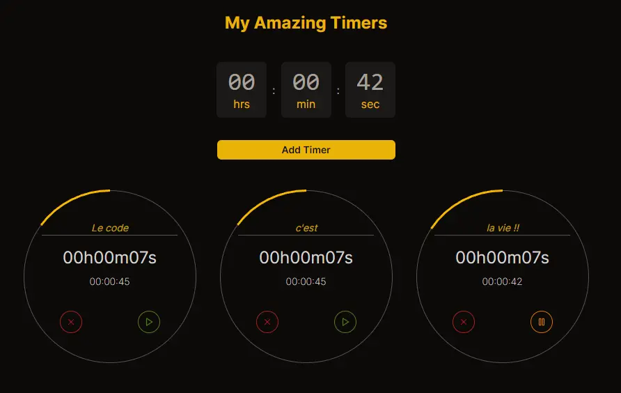
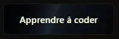
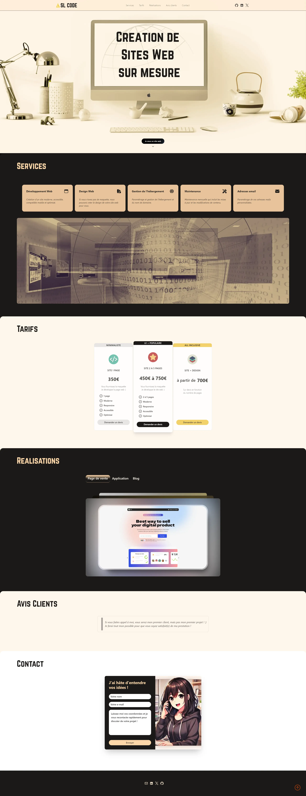

Comme tu le sais peut-être, je suis actuellement en “vacances” et crois moi, c’est pas du luxe. J’ai pu déstresser un peu et surtout, coder, coder, coder !

### APPLICATION DE TIMERS

J’ai participé à un nouveau challenge de Melvyn qui m’a bien donné du fil à retordre. On devait coder une application de timer avec plusieurs critères à respecter.

**Liste des fonctionnalités :**

✅ Il est possible d’ajouter un Timer en définissant les heures, les minutes et les secondes

✅ Il est possible d’ajouter plusieurs Timers

✅ Après l’ajout du Timer celui-ci se lance automatiquement

✅ Il est possible de mettre “Pause” et “Play”

✅ Il est possible de supprimer un Timer

✅ Quand le timer se termine, il y a un son qui est activé

**Fonctionnalité BONUS :**

✅ Ajout de notifications du navigateur

✅ Possibilité de données des noms aux Timers

❌ Possibilité de changer l’ordre des Timers

J’ai bien galéré sur la partie où il fallait récupérer les heures/minutes/secondes en entrée pour les envoyer dans le timer. J’ai passé toute une soirée dessus, en stream, au grand désespoir de mes viewers qui tentaient de m’aider 😅 Mais j’ai eu beau m’obstiner, rien ne fonctionnait !

Et le lendemain matin, l’illumination pendant que je buvais mon café (tous les devs connaissent ce moment où tu résous en 2 minutes le truc qui t’a cassé la tête pendant des heures la veille 😂 )

Je te passe les détails techniques, j’ai finalement réussi à passer mes données correctement des inputs vers mes timers, et le reste à été plutôt facile à faire fonctionner. Je dis faire fonctionner parce que je sais pertinemment que mon code est pas ouf (pour pas dire dégueulasse) mais j’y reviendrais dans quelques temps et j’essayerais de le refactoriser proprement.

Au final, je suis plutôt contente du résultat, j’aime bien mon design, rien de foufou, mais pas dégueu et tout fonctionne comme je le souhaitais. A la review, j’étais plutôt bien placée, dans les 3 ou 4 premiers et encore une fois, c’est Marlène qui a tout raflé !! (je l’aurais un jour ! 😂 )

Je te laisse découvrir mon chef d’oeuvre par ici : https://timer-app-challenge.vercel.app/

### INTEGRATION DE MAQUETTE

Après ça, je me suis lancée dans un petit hackaton front-end sur l’excellente plateforme [Spikes](https://www.spikes-challenges.fr/).

Si tu es dev et que tu as besoin de t’améliorer en design et/ou en front, cette plateforme FR est vraiment stylée ^^ Il y a des maquettes à reproduire, des challenges à relever, des reviews d’intégration, des conseils pour progresser, un discord privé très actif, bref ça vaut vraiment le coup !

En 3 sessions, j’ai plié la maquette, je me suis placée 3e ex aequo, je suis plutôt contente ^^ Après, la maquette était plutôt simple, mais j’avais besoin de faire un truc chill, pas trop prise de tête et satisfaisant.

Voilà le résultat du coup : https://spikes-hackaton-lp1.vercel.app/

### MA PAGE D’AFFILIATION

Tu as peut être remarqué ce nouveau bouton trop stylé sur ma page d’accueil ?

Melvyn a lancé son programme d’affiliation et j’ai voulu regrouper tous mes liens sur une seule page histoire de pouvoir les retrouver facilement et linker cette page directement en cas de besoin.

Je l’ai codée de A à Z sans l’aide de mon pote GPT alors je suis contente, ça montre que mes cours commencent à rentrer ^^ (rien de sorcier tu me diras, y’avait juste à mapper des liens dans des cards, mais ça m’a fait kiffer de mettre en applications des exos que j’avais fait quelques temps auparavant dans ma formation)

Trop jolie ma petite page d’affiliée non ?? https://www.sl-code.dev/affiliate

D’ailleurs, si toi aussi tu veux coder des pages aussi stylées, n’hésites pas à cliquer sur l’un des liens et à me rejoindre dans mon aventure !! 😂

### MA LANDING PAGE

Enfin, avec tout ça, je me suis senti pousser des ailes ! Je me suis dis que j’étais déjà assez expérimentée pour créer des sites web pour des clients. Alors j’ai décidé de me créer une petite landing page que je pourrais linker à des potentiels futurs clients qui seraient intéressés pour travailler avec moi.

Et là, c’est le drame… j’y ai passé **beaucoup** de temps… pour un résultat vraiment … meh ! 😅

J’ai demandé leurs avis à mes copains devs sur Discord et au final, y’a rien qui va ! Le design part dans tous les sens, ça manque de cohérence, j’ai aucun projet réel à mettre en avant (à part mon propre blog), les tarifs sont hors-sol et le copywriting est nul. On dirait que ça a été codé par ma nièce de 10 ans…

Je te laisse juger par toi-même : https://www.sl-code.dev/lp (attention, je n'ai pas du tout fait le responsive donc sur mobile ça ne sert à rien de regarder)

De toute évidence, j’ai encore pas mal de lacunes (et ma foi, c’est normal je pense ^^). Alors je vais arrêter de faire mumuse et me refocus sur mes formations. Il faut absolument que je termine [BeginReact](https://dub.sh/reactlp-slcode) et que je puisse commencer [NextReact](https://dub.sh/nextlp-slcode) rapidement. Il faut avancer !!!

Alors je te retiens pas plus, moi je retourne bosser tout ça 🤩

En attendant prend soin de toi, et à la prochaine ! 🚀

---

Je mets une photo pour l’antologie parce que je vais pas laisser ça en ligne très longtemps 😅

