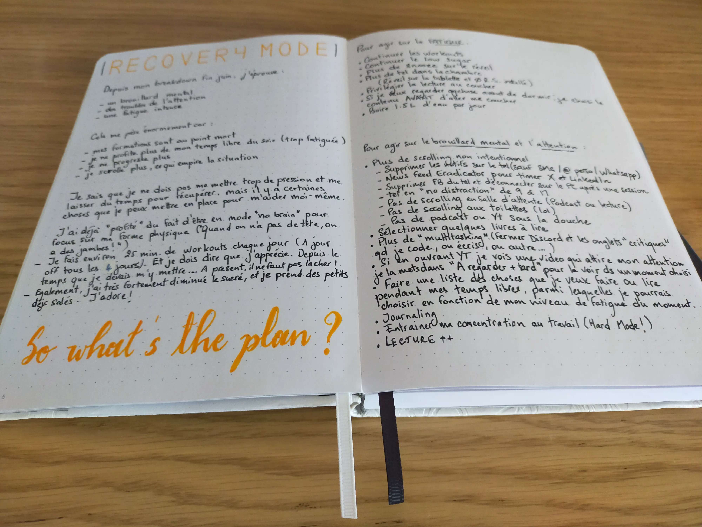
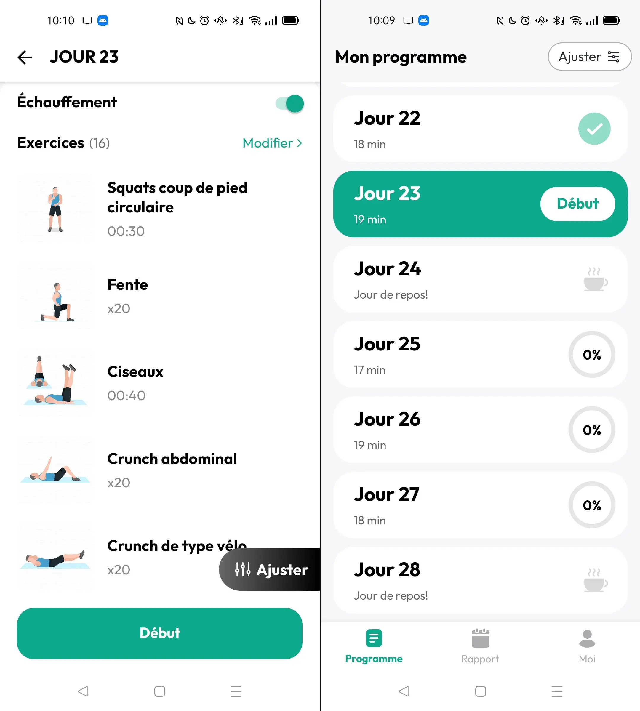
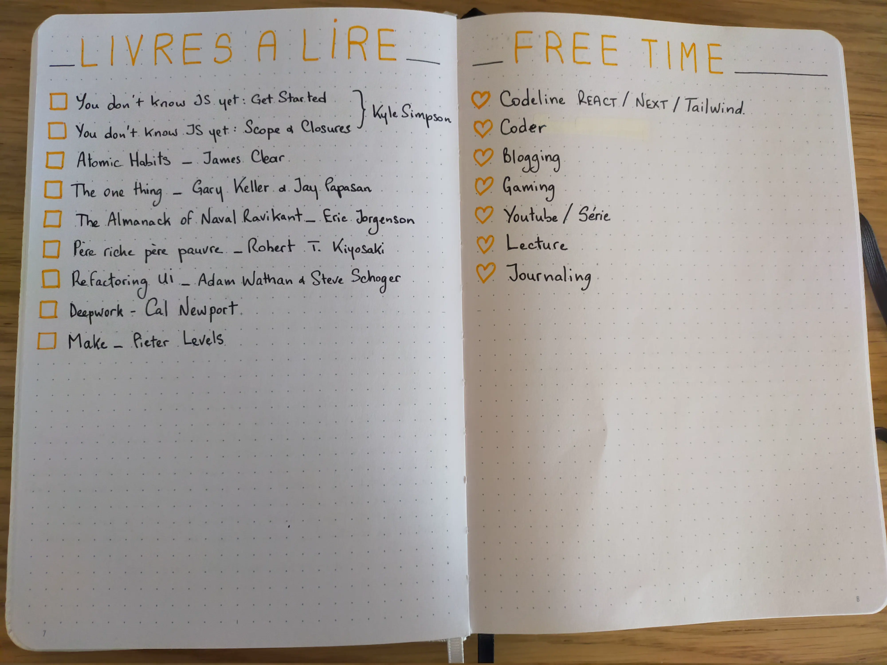

Tu le sais peut-être, fin juin dernier, j’ai eu une sorte de craquage, dû à une surcharge mentale et émotionnelle.

Depuis, j’éprouve une fatigue intense, des difficultés à me concentrer et un brouillard mental.

J’ai eu 5 semaines de vacances, je me suis dis que ça m’aiderait à remonter. Effectivement, j’étais plus zen, mais toujours fatiguée et confuse. Puis j’ai repris le travail début Août, et les 2 premières semaines ont été compliquées (toujours fatigue, brouillard mental, zéro motivation, etc…)

Ca me pèse énormément car depuis, mes formations React/Next sont au point mort, je ne progresse plus. Je n’arrive plus à m’y mettre le soir car je suis trop fatiguée. Résultat, je passe plus de temps à scroller sur X, ce qui me rend encore plus fatiguée et déconcentrée…

Alors j’ai dit **STOP** !

Je me suis posée, et j’ai établi un véritable plan pour reconquérir mes capacités cérébrales et me sentir moins fatiguée.

Rien de très compliqué, le but c’est pas de me fatiguer encore plus, ni de me mettre la pression.

## AGIR CONTRE LA FATIGUE

### Un peu de sport

Rien de compliqué, j’utilise l’appli “Perte de poids pour homme” qui propose une série d’exercices qui varient un peu chaque jour. La version gratuite fait bien le taff pour quelqu’un qui ne faisait jamais de sport à la base et qui préfère le faire tranquillement à la maison.

Les sessions durent 20 à 25 minutes environ. Je fais 3 jours de workouts puis 1 jour “off”. Pas de pression, si j’ai eu une journée chargée, je skip, mais je fais en sorte de ne pas skip 2 jours d’affilée (c’est important quand on essaye d’installer une habitude).

J’en suis au 23e jour (j’ai dû rater 2 ou 3 jours au max) et je trouve ça plutôt satisfaisant 🤩 Pour moi qui est plutôt “feignante” niveau sport, je me surprend à apprécier ça, avoir hâte de rentrer le soir pour faire ma petite session, c’est dingue ! Et puis il faut dire que je commence déjà à voir des résultats physiquement, ça motive de fou !

### Low Sugar

Tu le sais peut-être, manger sucré provoque un pic de glycémie qui est ensuite suivie par une chute brutale du taux de glycémie ce qui donne un coup de barre (et une sensation de faim). D’ailleurs, cette chute de glycémie agit aussi sur la concentration, donc en éliminant les sucreries de mon alimentation, je fais d’une pierre deux coups ^^

Pour moi qui est très gourmande et adore le sucré, surtout le chocolat, ça paraissait être un gros défi (j’ai souvent essayé de me passer de sucre sans succès). Et pourtant, tout comme l’installation de ma routine “sportive”, ça s’est fait naturellement et sans forcer… Ca ne me manque même pas 😲

Bien sûr, j’ai gardé les fruits et il m’est arrivé de manger une glace un week-end quand j’ai reçu des invités, mais toujours, sans pression 😄

### Petit déjeuner salé

Le matin, si j’ai faim, j’ai troqué mes 4 madeleines hyper sucrées (mais teeeellement bonnes 🤤) contre l’une de ces deux recettes.

[oeufs au plat & tomates](https://www.cuisinonsencouleurs.fr/2022/11/oeuf-et-tomates-pour-un-petit-dejeuner-sale-express.html)

[tartine saumon avocat](https://www.cuisinonsencouleurs.fr/2021/02/tartine-au-saumon-et-a-lavocat-avec-un-oeuf-mollet.html)

Et honnêtement, je me casse le ventre (et oui, je t’avais dis que j’étais gourmande, j’adore manger 😅) Ca me permet de faire le plein d’énergie pour la matinée et d’éviter la fringale et le coup de barre à 11h ^^

Je cherche d’autres recettes rapides à faire pour varier un peu. Les oeufs à la tomate ça va, c’est hyper rapide à faire, mais les tartines saumon c’est un peu plus long, du coup c’est souvent le week-end que je choisi cette recette.

### Pas de “Snooze” sur le réveil le matin

Adepte du “snooze” depuis des années, ajouter 10 minutes, puis encore 10 minutes à son réveil avant de finalement daigner se lever, c’est en fait totalement contre-productif. Se rendormir (légèrement) 10 minutes puis se réveiller, puis se rendormir, etc, ça a un effet désastreux. On se sent au final encore plus fatigué et on installe un climat de “procrastination” dès le réveil.

Pour supprimer définitivement la tentation d’appuyer sur le fameux bouton, ma technique est simplement de mettre mon téléphone sur une étagère en hauteur, hors de ma portée, et je suis donc obligée de me lever pour l’éteindre ^^

Et mon petit bonus pour un réveil vraiment efficace ? C’est ce son qui se déclenche, il a un effet absolument “magique” sur moi, ça me fait délirer de me réveiller et d’entendre ça direct :

<YouTube id="enYdAxVcNZA"></YouTube>

Juste d'entendre les premières secondes je suis morte de rire 🤣

### Plus de téléphone avant de dormir

J’aime regarder des vidéos pour m’endormir. Ca ne m’a jamais empêché de m’endormir au contraire. En fait, mon cerveau est programmé pour s’endormir quand je me couche et que je lance une vidéo sur YouTube, **surtout** celles du “Joueur du Grenier” 😅. Pas de malentendu, **j’adore** JDG. Et du coup, pendant des années je me suis endormie en me repassant leurs vidéos, ce qui fait que dorénavant, au moindre signe d’insomnie, je lance une de leurs vidéos et je m’endors très peu de temps après le générique 😂

Mais le souci, c’est qu’**AVANT** de regarder une vidéo, je passais mes notifs en revue, un petit tour sur Discord, un peu de scroll sur X, puis sur YouTube pour trouver une vidéo qui me plaît. Et le temps passait… et je perdais des minutes voir des heures précieuses de sommeil !

Donc maintenant que mon téléphone est hors de portée, j’utilise ma tablette pour regarder des vidéos et je sélectionne, **avant** d’aller me coucher la vidéo que je vais regarder (ça m’évite de scroller sur YouTube du coup ^^). Bien sûr, aucun réseau social n’est installé sur ma tablette pour éviter toute tentation !

### Privilégier la lecture au coucher

Si je me couche suffisamment tôt et si j’ai assez d’énergie, j’ai décidé de reprendre la lecture. Quand j’étais ado, je lisais beaucoup. Puis internet et World of Warcraft sont arrivés, puis les réseaux sociaux et enfin, les enfants… Et comment te dire que la lecture ne fait plus vraiment partie de ma vie depuis longtemps…

Pourtant il y a beaucoup de livres que je voudrais lire, sans vraiment trouver le temps… J’ai donc téléchargé plusieurs ebooks qui me tiennent à coeur et je les ai mis sur ma tablette pour pouvoir les lire, petit à petit, avant de dormir ^^

Gros bonus, la lecture est l’une des activités qui entraîne le plus la capacité de concentration car on doit être focus sur **une seule** chose pour cette activité !

## RETROUVER LA CONCENTRATION

Outre la lecture donc, qui va me permettre d’améliorer mon focus, j’ai décidé d’agir sur le plus gros facteur de perte de concentration, j’ai nommé **le smartphone et les réseaux sociaux**.

Tu le sais peut-être, le scrolling intensif est un fléau pour notre capacité à nous concentrer et à nous motiver. En agissant sur notre production de dopamine, le scroll va activer à outrance notre système de récompense. Notre cerveau se sent récompensé très vite, et sans produire d’effort. Du coup, il devient de plus en plus dur pour nous de faire une activité qui va demander un certain effort avant d’être récompensé. A la moindre notif, tu auras envie de te jeter sur ton smartphone pour récupérer ta dose de dopamine (oui ton cerveau est devenu dépendant). D’ailleurs, tu vérifies presque inconsciemment ton téléphone, en quête d’une notif que tu aurais pu rater, et tu n’arrives plus à te motiver et te concentrer.

Si tu veux en savoir plus sur ce sujet, je te mettrais en fin d’article quelques liens vers des vidéos YouTube très intéressante. Si tu es accroc à ton smartphone et aux RS, file les voir, elles pourront peut-être te faire réaliser l’importance d’agir pour ta santé, autant mentale que physique !

Me concernant, j’ai donc commencé par éliminer le **scrolling non intentionnel**. Et pour ça, j’ai pris quelques dispositions et établi quelques règles :

- Enlever toutes les notifs sur mon tel (sauf SMS & mail perso).

Plus de notifs X, LinkedIn, Youtube, Facebook, etc… je peux te dire que ça fait un paquet d’occasion d’être déconcentrée en moins !

- Utiliser l’extension Chrome **Newsfeed Eradicator** pour chronométrer mes sessions sur X.

Si je veux aller sur X, je dois d’abord aller sur la page de l’extension et l’autoriser pour 5/10/30 minutes. Après quoi, le feed se vide à nouveau.

- Désinstaller Facebook sur le tel et l’utiliser sur le PC uniquement pour Messenger si besoin.

- Téléphone en mode **sans distractions** de 9h a 17h. Ca m’évite d’être tentée de scroller au travail. Typiquement, si je veux quand même aller voir mes notifs Discord ou X pendant ma pause café, je peux lancer l’appli pour 5 minutes et elle se ferme ensuite automatiquement.

- pas de scrolling aux toilettes 😅 (parce qu’après je slack plus que nécessaire 😂)

- pas de scrolling dans les salles d'attente

Préférer un podcast ou lecture, l'objectif étant toujours de favoriser les activités qui renforcent la concentration

A côté de ça, j’élimine aussi au maximum le Multitasking (en fermant Discord et les onglets inutiles quand je code ou quand j’écris, toujours pour favoriser la concentration.

J’arrête d’écouter des podcasts sous ma douche, parce que c’est bien aussi d’avoir des temps d’introspection où on peut juste laisser aller ses pensées, c’est souvent comme ça qu’on trouve de nouvelles idées d’ailleurs.

J’ai fait une liste des choses je veux faire pendant mes temps libres, parmi lesquelles je peux choisir en fonction de mon temps disponible et de mon niveau de fatigue du moment.

J’ai repris le journaling, histoire de pouvoir déposer tout de suite les choses auxquelles je dois penser plus tard, de plannifier certaines choses, etc. ce qui me permet d’alléger mon cerveau.

Enfin, tu le sais peut-être, mon travail de comptable est devenu un peu un fardeau pour moi. Je n’y prends plus de plaisir car il ne m’intéresse plus et il est donc d’autant plus difficile pour moi de rester concentrée au travail.

Et bien j’ai décidé de transformer ce fardeau en défi pour augmenter ma capacité de concentration! Je me dis que si j’arrive à redevenir réellement productive au travail, avec de vraies sessions de focus, alors j’aurais encore plus de facilité à le faire sur des tâches qui me plaisent comme le code ou mes formations sur Codeline ! 🤩

Avec cet état d’esprit, travailler en tant que comptable ne me paraît plus totalement vide de sens, puisque ça me permet de devenir meilleure même **en dehors** de ce travail ! Et c’est un véritable **CHEAT CODE** pour rester motivée et concentrée !

Cela fait une semaine que j’ai commencé à appliquer tout ça, et ça fonctionne de fou ! J’ai abattu énormément de tâches au travail, cela faisait longtemps que je ne m’étais pas sentie aussi productive et j’en ai retiré un sentiment de satisfaction qui m’incite encore plus à continuer ainsi ^^ (c’est le pouvoir magique de la dopamine dont je te parlais plus haut 😊)

Le soir, je suis encore pas mal fatiguée, mais j’ai **enfin** réussi à faire une session de Codeline un soir, et une session de projet collaboratif sur Discord un autre soir ^^ C’est une vraie victoire pour moi ! 💪

Voilà ! Je ne sais pas si cet article t’aura intéressé ? peut-être que tu auras pu piquer quelques astuces ? Si c’est le cas, n’hésites à m’écrire par mail ou directement sur X [@StellaSLcode](https://x.com/StellaSLcode), je serais ravie d’avoir ton retour ! 😍

A la prochaine et en attendant, prends soin de toi !! ✨

---

Comme promis, ci-dessous les liens vers les excellentes videos de Fabien Olicard, Charlie Haid et Leo Duff concernant l’effet des réseaux sur notre capacité de concentration et de motivation :

## <YouTube id="V1Wno3RdrdU"></YouTube>

## <YouTube id="IpSDix2BEiQ"></YouTube>

## <YouTube id="vptUt4Db310"></YouTube>

## <YouTube id="FALDuZ5pPxc"></YouTube>

<YouTube id="eUB6zkW-e5Y"></YouTube>
