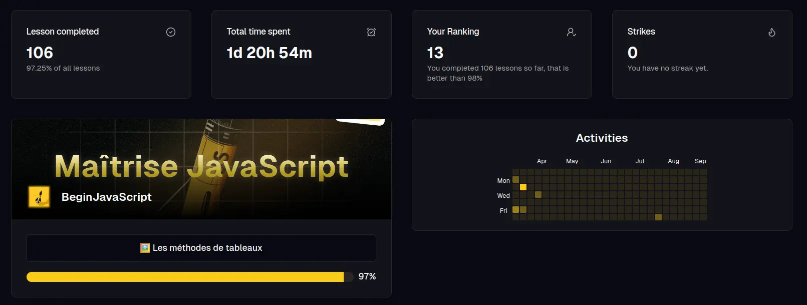
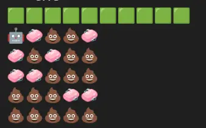
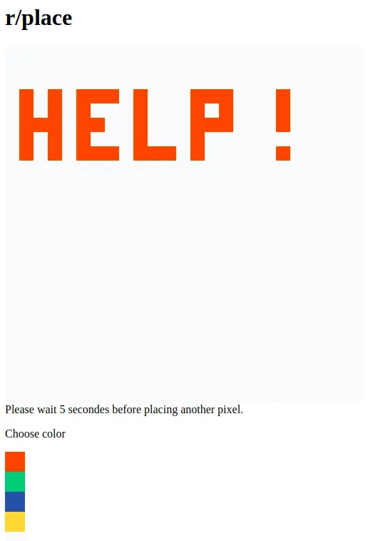
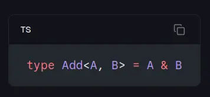

<h1 className="titre " style={{ textAlign: "left" }}>
  Pourquoi j’ai choisi les formations de Melvyn ?
</h1>

Quand on veut se reconvertir dans le développement, il y a des dizaines d’options. Ecoles en présentiel, en distanciel, bootcamps, formations en ligne, tutoriels, etc…

C’est la jungle pour démêler tout ça, chaque option a ses avantages et inconvénients, il faut alors choisir en fonction de ses contraintes et de sa personnalité.

## Mes contraintes

Je suis mère de famille, j’ai un boulot à temps plein et le budget du foyer ne me permet pas d’aller pointer au chômage.

### 🏫 Les écoles et organismes de formation

On élimine directement les écoles, que ce soit en présentiel ou en distanciel, avec mes horaires je ne peux pas d’assister aux cours. C’est dommage car les écoles permettent d’obtenir des certifications qui peuvent peut-être aider par la suite à décrocher un emploi, mais ce n’est pas pour moi actuellement.

### 🏕️ Les bootcamps

J’en entend pas toujours du bien, et vu le prix, y’a pas intérêt à se tromper. De toute façon, les tarifs sont en vérité trop élevés pour moi et le rythme est beaucoup trop soutenu pour quelqu’un qui bosse et qui a une vie de famille à côté. C’est next…

### 🤑 Les tutos et cours gratuits

Se former grâce à des ressources gratuites trouvées ça et là sur le net, c’est tentant. Mais quand on réalise l’ampleur des sujets à aborder, même avec une roadmap en béton, ça demande beaucoup de temps, de patience et d’auto-discipline. Je suis débrouillarde, mais n’avoir aucun cadre et être seule dans la jungle des tutos et cours gratuits, ça me semble vraiment être une perte de temps et d’énergie.

### 🌐 Les formations en ligne

Elles ont tous les avantages en fonction de mes contraintes :

- Elles sont plus abordables
- Je peux les suivre à mon rythme sur mon temps libre
- Elles offrent un cadre ce qui est très appréciable

## Les avantages de [Codeline](https://dub.sh/codeline-slcode)

Parmi toutes les formations en ligne, j’ai choisi celles de Melvyn pour plusieurs raisons :

1. 
La plateforme

   Codeline, c’est la plateforme développée par Melvyn pour délivrer ses formations. Elle est spécialement conçue pour apprendre le dev, et elle sert à la perfection sa méthode d’apprentissage.

   Les supports de cours sont variés, on a du texte, des schémas, des vidéos assez courtes, des quizz, des questions corrigées par IA, des petits exercices à faire directement dans le navigateur pour mettre en pratique tout de suite ce qu’on apprend.

   Mais aussi des exercices un peu plus longs à faire dans VSCode, donc on apprend aussi à créer des projets, à manipuler github, en plus d’apprendre à coder.

   Et enfin, il y a des gros exercices (les workshops) qui permettent de mettre en pratique ce qu’on a appris en fin de module en réalisant des petits projets dont certains peuvent carrément être déployés, c’est super stylé !

   Et puis bon, disons ce qui est, la plateforme est trop belle ! Ca donne vraiment envie de se connecter et d’avancer 😁

   

2. 
La Méthode CAPE

   C’est la méthode d’apprentissage que Melvyn utilise. Elle permet de mémoriser et de comprendre les concepts en te mettant face à une “difficulté désirable” comme il l’appelle.

   Il te donne quelques pistes et indices, le lien d’une documentation, et il te demande de faire un exercice. Tu dois te débrouiller comme le ferait un développeur devant une nouvelle problématique. Le fait de chercher par soi-même va aider ensuite à créer des connexions dans ton cerveau. Même si tu n’as pas réussi l’exercice, quand tu vas voir la solution qu’il te propose, tu vas mieux comprendre et mémoriser le chemin de pensée nécessaire pour résoudre le problème.

   C’est une méthode très efficace, en tout cas, elle fonctionne très bien sur moi, surtout moi qui adore résoudre des énigmes, c’est un kiff total 😄

3. 
La communauté privée Discord

   Le défaut d’une formation en ligne, c’est qu’on est un peu seul face à ses cours. Mais sur le Discord “Codeline”, j’ai trouvé une véritable communauté avec qui partager mes avancées, mes blocages, mes galères, mes délires ! Moi qui suis une passionnée, j’ai besoin de pouvoir partager cette passion et je peux le faire sur ce Discord où les membres les plus réguliers sont devenus de véritables camarades, comme dans une vraie formation ! Certains sont plus avancés, d’autres viennent d’arriver mais l’entraide est vraiment présente et précieuse.

4. 

     Les facilités de paiement et les promos spéciales pour les membres
   

   Et oui, ça pèse dans la balance, quand t’as un foyer et un budget un peu serré, le fait de pouvoir payer en plusieurs fois, ça aide pas mal ^^ Et une fois que tu es membre d’une des formations de Melvyn, tu as des prix privilégiés pour les autres formations, et ça c’est vraiment appréciable ! (en plus, tu peux participer à des challenges et parfois gagner une énorme reduc sur d’autres formations 😄)

5. 

     La garantie "Satisfait ou Remboursé" sans conditions
   

   Oui, je disais que les formations en ligne sont plus abordables, mais ça reste quand même un petit investissement, et quand on ne connaît pas encore le contenu, cette garantie est très rassurante, et ça permet de se lancer sans risque.

## L’importance du formateur

Enfin, le point le plus important pour moi dans une formation, _c’est le formateur_. Il faut qu’il soit compétent c’est sûr, mais il faut aussi que sa personnalité colle avec la tienne. Si il n’y a pas un bon feeling, ça sera difficile de suivre la formation jusqu’au bout.

Jackpot avec Melvyn, j’ai trouvé tout ce dont j’avais besoin de la part d’un formateur. Il est qualifié mais surtout il est dynamique, passionné, accessible et bienveillant.

Moi j’ai besoin que ça bouge, que ça aille vite mais aussi que ça soit fun et entraînant pour rester concentrée et motivée. Mon combo parfait ! 🤩

## Conclusion

Tu l’auras compris, je ne regrette pas d’avoir choisi ces formations, pour toutes les raisons ci-dessus, mais **surtout** quand je vois où j’en suis aujourd’hui, après avoir terminé BeginJavascript et BeginReact.

<h1 className="titre " style={{ textAlign: "left" }}>
  <a href="https://dub.sh/beginjslp-slcode">BeginJavascript</a>
</h1>

Le 15 Janvier 2024, j’ai sauté le pas en prenant ma première formation BeginJavascript. Quelques heures et un “Hello World” plus tard, j’étais à fond, intimement persuadée que j’avais trouvé ma voie.

Les exercices qui m’ont le plus marquée sont “le robot nettoyeur” à base d’emojis 🤖, 🧼 et 💩, et le **r/place**. C’est un véritable “trauma” pour le r/place d’ailleurs, que je n’ai pas réussi à coder à l’époque ! 😂 (je me vengerai à l’occasion XD)

Si tu te demandes, le r/place c’est simplement une grille blanche, composée de x carrés, et tu peux sélectionner une couleur dans un colorPicker et poser ce pixel de couleur sur ta grille. C’est tout ! ça m’a donné beaucoup de fil à retordre, surtout que je ne connaissais pas vraiment le HTML/CSS sur le moment et j’ai dû aller me former en speed histoire de comprendre un minimum ce que je faisais 😅

C’était folklo, j’ai pas voulu lâcher l’affaire, mais j’ai dû m’avouer vaincue si je voulais continuer d’avancer 😂

Au final, il m’a fallu 2 mois pour terminer la formation, en m’y mettant 2h le soir et un peu l’après-midi le week-end. Et il faut savoir que j’ai vraiment pris mon temps pour les workshops, je n’allais pas voir la solution tant que je n’avais pas réussi (ou au moins galéré plusieurs heures, oui je suis maso 😅)

Alors imagine, si j’avais eu beaucoup de temps libre, j’aurais pu l’achever en moitié moins de temps !! En tout cas, avec tout ça j’ai pu acquérir tous les concepts essentiels de JavaScript et commencer BeginReact sur de bonnes bases.

<h1 className="titre " style={{ textAlign: "left" }}>
  <a href="https://dub.sh/reactlp-slcode">BeginReact</a>
</h1>

Quand j’ai commencé BeginReact, Melvyn venait tout juste de la mettre à jour. Et ça a été un vrai plaisir à suivre 😍 Les chapitres s’enchaînaient, c’était hyper fluide ! C’est vraiment un super travail qui a été fait avec cette formation.

Les workshops aussi ont été très agréables à faire :

[React Doc Cards:](https://beginreact-workshop-components.vercel.app/) simple mais satisfaisant, pour une première mise en pratique du useState. Et ça permet en plus d’utiliser Tailwind, petit kiff perso 🤩

[My Movie Finder:](https://my-movie-finder-slcode.vercel.app/?search=interstellar) très sympa pour apprendre à fetch une API, utiliser useEffect, useDebounce, le local storage, etc…

[My Amazing Timers:](https://www.sl-code.dev/timer) ma première petite fierté. Une application de timers qui m’a donné un peu de fil à retordre, avec laquelle j’ai appris à utiliser Zustand pour gérer des states globaux, très intéressant !

[Editeur d'image:](https://beginreact-elevator-generator.vercel.app/) ma bête noire ! j’ai aimé me casser les dents dessus même si je n’ai pas réussi à télécharger l’image finale 😄

De mon côté, j’ai mis plus de temps à achever BeginReact mais c’est surtout dû à des contraintes personnelles qui m’ont fait prendre pas mal de retard.

<h1 className="titre " style={{ textAlign: "left" }}>
  Ou j'en suis ?
</h1>

Grâce à ces deux formations, j’ai pu réaliser 2 choses dont je suis déjà très fière 🤩

1. Ce blog ici présent. Il est en React et Next.js. Même si j’ai suivi un tuto pour réaliser la structure de base (principalement parce que je l’ai codé **AVANT** de faire BeginReact), j’y ai apporté beaucoup de modifications et ça grâce à tout ce que j’ai appris mais aussi grâce à la faculté de chercher des solutions et de lire les documentations. Faculté que Melvyn encourage beaucoup dans sa pédagogie et qui est essentielle pour être un bon dev. J’ai personnalisé les styles et les composants, j’ai ajouté mes propres composants, configuré l’inscription à la newsletter, etc…
2. Mon **”[Snake Game](https://www.sl-code.dev/snake)”** 😎 A la fin de BeginReact, il y a un exercice qui demande juste de coder les déplacements du serpent dans un jeu de “snake”. Je me suis comme qui dirait 🔥“enflammée”🔥 et j’ai codé mon propre Snake avec mes styles, une gestion des mouvements avancée, un tableau des scores. J’ai appris à setup une Base de Données PostgreSQL, à communiquer avec grâce à une ORM (Prisma), j’ai configuré un nouveau formulaire avec envoi de mail, etc… Mais **SURTOUT**, j’ai mis un point d’honneur à réaliser tout ça **sans IA** (pas de GPT, pas d’auto-completion). Je me suis éclatée à le faire et ça m’a boostée de ouf, comme quoi j’ai vraiment capitalisé tout ce que j’ai appris 💪

Non mais sans déconner, t’en connais beaucoup toi des comptables qui peuvent coder un Snake aussi stylé ? 😎

<h1 className="titre " style={{ textAlign: "left" }}>
  Et apres ?
</h1>

Je viens d’attaquer ma 3e formation, [NextReact](https://codelynx.dev/posts/formation-nextjs) ! 🤩 Je suis très enthousiaste car j’ai déjà effleuré Next.js via mon blog et c’est une techno qui à l’air vraiment incroyable !
J’ai commencé le premier module, une introduction à TypeScript, et c’est… difficile à expliquer 😂 Autant je vois les bénéfices et avantages de TS, autant j’ai du mal à me faire à certaines syntaxes 😅

Typiquement, ce genre là…. 🤯 je capte pas 😅

En vérité, je sais que c’est juste une question d’habitude et que je vais m’y faire xD C’est une très bonne chose que toute cette formation soit en TypeScript plutôt que JavaScript, j’ai très hâte d’avancer et de découvrir toutes les subtilités de Next 😍

L’objectif, c’est de terminer NextReact avant le 31 Décembre, pour pouvoir commencer à chercher des missions ou postes début d’année 2025. En parallèle, je coderai mes premiers vrais projets persos et je créérai mon portfolio.

Il y a encore beaucoup de choses que je veux découvrir, notamment approfondir tout ce qui concerne le backend, mais aussi le devOps. Tout m’intéresse et je ne sais pas encore vers quoi je veux me “spécialiser” ! 😅

Une seule chose est sûre, je vais tout donner pour me faire une place sur le marché en 2025 !! 🔥 🚀 ✨

Voilà, j’espère que cette petite rétrospective t’aura intéressé(e) ! Moi ça me booste de ouf en tout cas 😄

Je te dis à la prochaine et en attendant, prends soin de toi !! ✨
