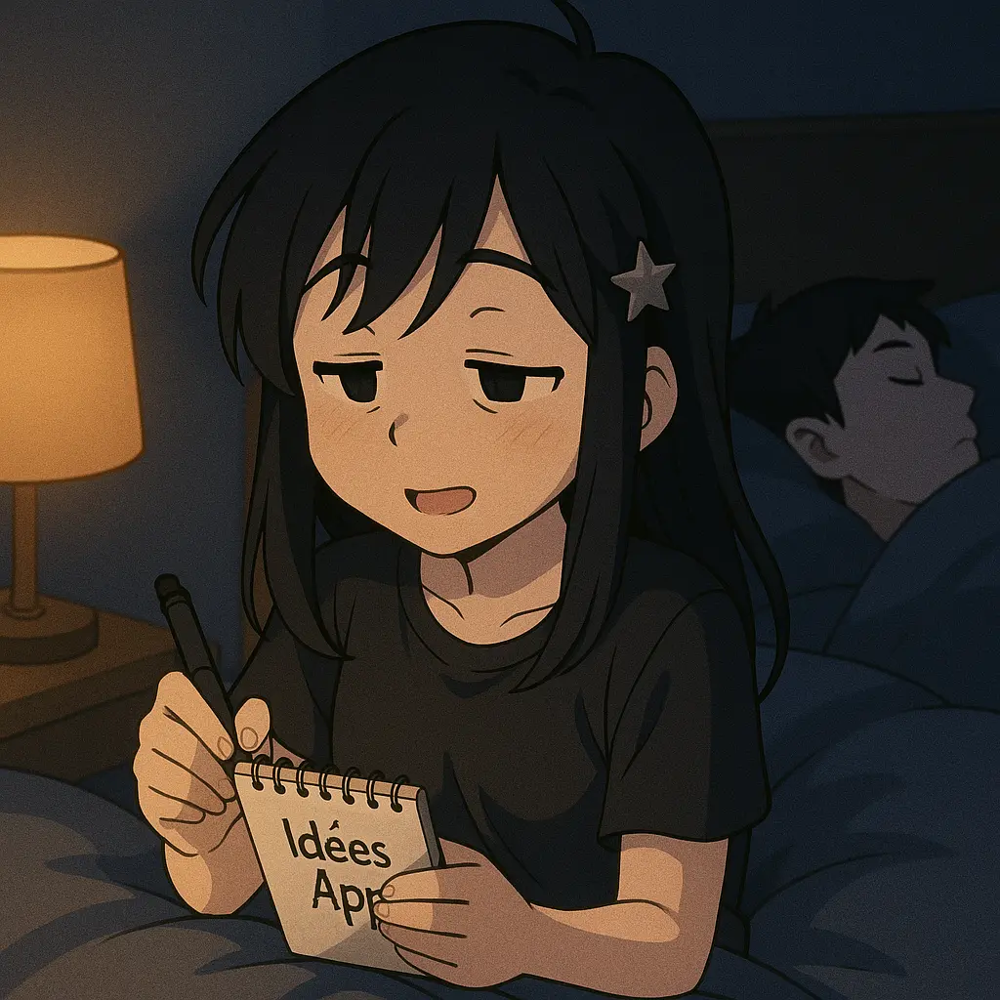
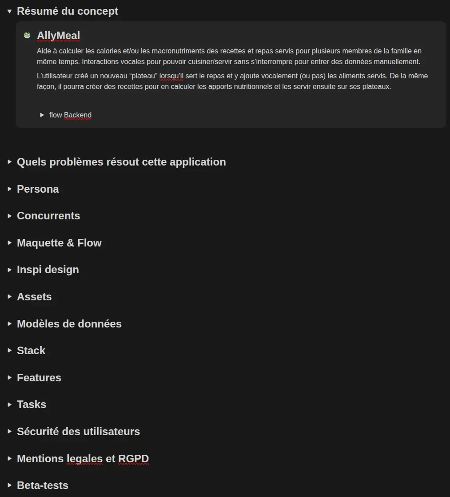
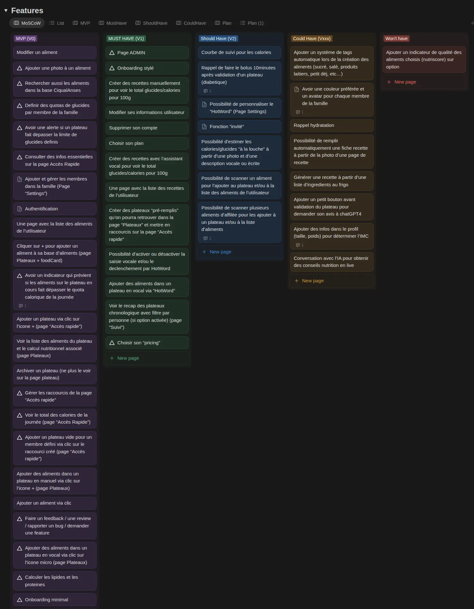
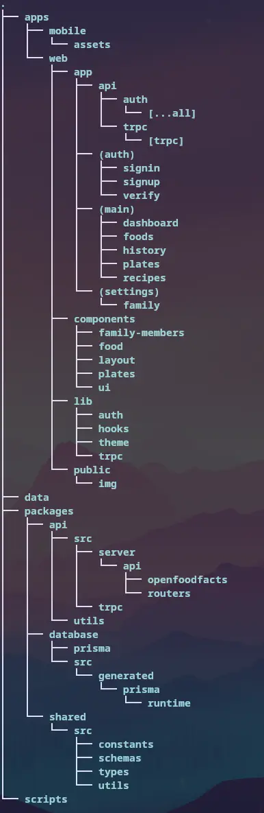
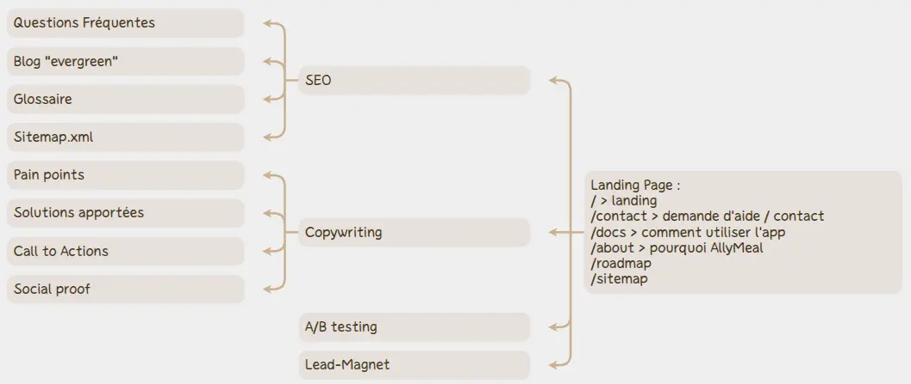

C’est quoi le concept, pourquoi je l’ai choisi, qu’est-ce qui va le différencier d’autres projets similaires, qu’est-ce qu’il a de si ambitieux ?

Alors t’es prêt(e) ?!

Mon appli est ….

🔽

🔽

🔽

🔽

🔽

🔽

🔽

🔽

🔽

🔽

🔽

🔽

🔽

🔽

🔽

🔽

un calculateur de calories et de glucides, lipides, proteines !! 🎆 🎉 🎊

……………

J’imagine ta tête d’ici 😂 là tu te dis sûrement “elle a craqué !”, “y’en a déjà des dizaines” “y’a rien d’original, et y’a rien d’ambitieux !”

Mais laisse-moi t’expliquer déjà mon “WHY” !

### ❤️‍🔥 Pourquoi ce projet me tiens à coeur ?

Parce que j’en ai BESOIN ! Et oui, il existe bien des applis qui calculent les nutriments, mais elles ne respectent pas mes critères :

- Une fluidité parfaite : ZERO FRICTIONS
- Possibilité de gérer plusieurs membres de la famille : le plus important dans mon cas

Oui, j’ai besoin de suivre les calories pour moi et les glucides pour mes enfants et mon mari qui sont diabétiques. Et laisse moi te dire que c’est infernal, quand je cuisine une recette de calculer les macros pour tout le monde … Concretement ça donne ça :

- j’épluche un oignon
- je le pese
- je m’essuie les mains pour noter le poids de l’ingredient
- idem pour les pommes de terre, la creme, les lardons, etc (oui, c’est vrai, la tartiflette c’est pas très healthy 😅
- a la fin, je dois peser le poids total de la recette
- je dois chercher pour chaque ingredient l’equivalent en glucides et en calories pour 100g et le rapporter au poids que j’ai utilisé dans la recette
- enfin, je fais les totaux et je calcule les glucides et calories pour 100g de la recette
- et pour terminer, je pese combien de tartiflette je sers à chaque membre de la famille
- et j’ajoute eventuellement une entrée, un dessert, etc…

INFERNAL de faire ça PENDANT que tu cuisines…

Pendant longtemps j'ai utilisé l’appli “Le Secret du Poids” pour suivre mes calories. Elle permet de créer des recettes, de les enregistrer, mais pour tout remplir, c’est LONG ! Au bout de quelques temps, ça commence à aller un peu mieux quand tu as rentré pas mal de recettes et aliments mais ça ne fait QUE les calories… et surtout, ça ne fait qu'une seule personne...

Quand mes enfants sont devenus diabetiques en 2023, il a fallu commencer à calculer aussi les glucides, et du coup, j’ai laissé tomber mon suivi calorique (bye bye mon summer body !!! 😭 🤣)

Plus tard, je me suis fait un fichier Excel pour calculer les glucides et les calories en même temps, ça faisait le job, mais ça reste peu pratique, vraiment pas opti…

Il y a bien une appli qui semble réunir tout ce dont j’ai besoin, mais toujours pareil, elle ne gère qu’une personne à la fois…

Je me dis que je suis pourtant pas la seule à avoir ce genre de besoin non ? des familles où plusieurs personnes suivent leur alimentation pour des raisons similaires ou différentes, ça existe j’imagine ? un couple de sportifs, ils font comment ? chacun son appli et ils rentrent leurs recettes doublement ? ou alors on est la seule famille dans notre cas ? 😅

### ⏺️ Comment je vais me démarquer ?

Disons que la feature **“multi-profils”** serait vraiment LA chose qui serait différente des autres applis, ce qui pourrait peut-être être utile à certains foyers.

Mais je vais aussi tout faire pour pondre une **UX aux petits oignons**, que ça soit plus fluide et plus intuitif que tout ce qui se fait.

Je suis habituée à faire ces calculs, je sais ce qui cloche sur les applis que j’ai testé et je sais ce qu’il faut corriger et ce qu’il faut mettre en place pour arriver à l’experience **ULTIME** du calcul de macros !! (comment ça j’en fais trop ? t’es pas habitué(e) à force ? 😁)

Au pire, ça me sera toujours utile à moi, j’aurais enfin l’appli de calcul de macros dont je rêve ^^

Mais je crois que je peux VRAIMENT faire quelque chose de bien, j’ai une VISION 🤩 et j’ai de bonnes inspirations : entre autres [Melvynx](https://x.com/melvynxdev), [Marc Lou](https://x.com/marc_louvion), [Thomas Sanlis](https://x.com/T_Zahil), [Pauline_Cx](https://x.com/Pauline_Cx), [Max Blade](https://x.com/_MaxBlade), … Si tu les connais pas, fonce voir ce qu’ils font, ils sont tous incroyables !!

Et c’est là où je trouve ce projet ambitieux. C’est ambitieux pour une "dev junior" de se lancer là-dedans, il y a énormément d’aspects à prendre en compte, c’est pas n’importe quoi. Et je veux pas le faire n’importe comment. Et en plus, je veux faire une appli web ET mobile.

- Web pour le MVP, parce que je sais faire que ça pour l’instant, mais ça sera ultra responsive pour que ce soit propre et fluide même sur mobile.
- Mobile par la suite, si je vois que la demande est présente, et puis parce que c’est trop stylé, sur un portfolio de dev de dire que tu as fait une appli mobile.

J’ai encore énormément de travail à abattre pour achever mon MVP (et pour le lancer !). Et quand je pense à tout ça, je mentirais si je te disais que ça me fait pas paniquer un peu 😅

### 📋 Un peu d’organisation et de planification

Du coup, j’ai essayé de poser un maximum de choses “sur le papier” (aka dans Notion) pour me libérer le cerveau, et avancer, une chose après l’autre.

Dans mon projet sur Notion, j’ai tout noté au fur et à mesure de mon brainstorming, de mon avancée sur le projet et des idées qui popent dans ma tête n’importe où et n’importe quand.





Il y a pleeeein de choses hyper intéressantes là-dedans, mais je ne vais pas tout de dévoiler d’un coup ^^

Pour faire le tri dans les features, j’utilise la méthode MoSCoW pour déterminer celles que je veux intégrer ou pas dans mon MVP et dans mon appli à long terme.

C’est très simple, tu listes un peu toutes les idées de features que tu as, des principales aux plus secondaires. Et ensuite tu te poses et tu les ranges dans les catégories suivantes :

**MUST HAVE** : La feature qui est le coeur de ton app (ce sera ton MVP) et la ou les autres features essentielles

**SHOULD HAVE** : Les autres features qui seraient essentielles à intégrer, à développer dans un second temps

**COULD HAVE** : Les features qui pourraient peut-être sympa à ajouter, éventuellement

**WON’T HAVE** : Les features qui ne sont finalement pas pertinentes et qui ne seront pas intégrées à ton projet



Vu comme ça, on peut avoir l’impression que mon MVP est plein à craquer mais c’est parce que je “détaille” un peu les features, un peu en mode “user stories”. Je fais un 2 en 1 quoi…

Mais en gros, mon MVP ça sera juste :

- créer/supprimer/modifier le profil des membres de la famille (prénom, macro à suivre, quotas)
- chercher des aliments, pouvoir les ajouter à sa base personnelle et/ou les ajouter sur son plateau pour voir le total des macros.
- pouvoir faire la recherche/ajout en vocal (cette fonctionnalité là sera dans le plan premium, mais elle sera ouverte gratuitement dans la phase de MVP)
- aussi, je vais ajouter un accès rapide à des formulaires de feedbacks/reviews/feature request pour récupérer un max d’information de la part des utilisateurs, dès la phase de MVP

### 🛠️ On parle un peu “technique” ?

Pour la stack, elle est fortement “Melvyn Oriented” on va pas se mentir, mais en même temps, si je me suis formée sur cette stack, c’est pas pour utiliser autre chose 😅

Dans tous les cas, elle est plutôt bien adaptée à mon projet, il me semble (du moins, c’est ce qui est ressorti des multiples conversations avec mon conseiller (aka, Claude) ^^)

- MONOREPO avec turborepo
- Better-Auth (google / apple / facebook / email)
- PostgreSQL via Neon.tech
- Prisma ORM
- Zod
- tRPC
- TanstackQuery
- Next
- React
- TypeScript
- ReactNative avec Expo pour la partie mobile
- Tailwind CSS
- ShadcnUI
- Stripe
- Better-upload + Cloudflare R2 pour les images uploadées
- API Vocale / IA à déterminer
- API Alimentaire : OpenFoodFacts + import de la base Ciqual_Anses pour tous les produits non référencés par OFF
- Barcode scanner library : à déterminer
  - Proposé par chatGPT : https://github.com/mebjas/html5-qrcode

Niveau Architecture, en gros j’ai :

- un dossier “apps” qui contient
  - un sous-dossier “web/app” avec le code de l’appli web.
  - un sous-dossier “mobile/app” pour le code de l’appli mobile.
- un dossier “packages” qui contient le backend des deux applis :
  - api : contient tous mes routers tRPC
  - database : contient tout ce qui concerne prisma
  - shared : contient tout ce qui est susceptible partagé entre les applis web et mobile :
    - les schemas zod
    - les types
    - les constantes
    - les utilitaires



ça m’a l’air propre et logique, en tout cas je ne m’y perds pas (encore) alors que j’ai déjà pas mal avancé ^^

Au passage, j’ai décidé d’utiliser et donc de découvrir tRPC pour les endpoints API parce que ça à l’avantage d’être type-safe, bien adapté à une architecture monorepo et très compatible avec TanstackQuery et franchement je dois dire que J’ADORE ! 😍

Tu créées un context qui contient par exemple l’user, sa session, les headers et ta db prisma. Et ce contexte sera automatiquement retourné et utilisable dans toutes les procédures que tu vas créer ensuite. Du coup, pour tous tes endpoints tu n’as plus qu’à “appeler” la procedure et ça va ramener le context (donc l’utilisateur qui fait la requete, ses infos de sessions, headers, et toutes les methodes de prisma dans mon exemple).

Je pourrais te montrer en détail ce que ça donne dans un prochain article si ça t’interesse. En tout cas c’est hyper pratique !

```js
//Context : will be passed to all tRPC procedures
export const createTRPCContext = async (opts: { req: NextRequest }) => {
  const session = await auth.api.getSession({
    headers: opts.req.headers,
  });

  return {
    db,
    session,
    userId: session?.user.id,
    headers: opts.req.headers,
  };
};

export type CreateContextType = Awaited<ReturnType<typeof createTRPCContext>>;
```

### 👩🏻‍💻 Alors au travail !!

Voilà, comme tu l’as vu, il y a beaucoup de choses à faire encore pour terminer le MVP mais aussi pour préparer le lancement !

Je prévois un lancement sur ProductHunt pour le MVP et un lancement plus tard sur Uneed (pour l’instant ils sont complets !!) quand j’aurais une V1 bien stylée ^^

En fait en relisant je me rends compte qu'un lancement sur Producthunt ne serait pas adapté car mon SaaS est en français... Bon, je ferais certainement les 2 lancements sur Uneed dans ce cas (je préfère cette plateforme de toute façon)

Il me faudra aussi un Landing Page avec tous les ingrédients pour qu’elle cartonne :



### 🚀 On met les bouchées double à la rentrée !

La dernière semaine d’Août, je pars quelques jours en famille mais à partir de la rentrée, je vais travailler dur pour boucler tout ça le plus rapidement (et efficacement possible).

Et pour ce faire, j’ai prévu des sessions de deepwork de 4h, 4 matins par semaine, **en live sur Twitch** ! Des sessions “CodeWithMe” où tu pourras te connecter pour travailler toi aussi de ton côté, en parallèle avec moi. On appelle ça du “body doubling” et ça peut aider certaines personnes à rester focus plus facilement et plus longtemps ^^

Et pour rendre ça encore plus fun, je prévois des sessions de deep focus de 50 minutes, entrecoupées de “pauses” sportives de 10 minutes 🔥 Pendant 10 minutes, on sortira la tête de l’écran pour faire du renforcement musculaire et des étirements. Si tu le fais avec moi, tu auras plus l’excuse de dire que tu trouves pas le temps de faire du sport, ça te fera minimum 40 minutes de sport, 4 fois par semaine ! Si tu es du genre inactif (comme moi ces derniers temps), c’est énorme comme changement ! 💪

Alors si ça te tente d’allier deepwork et mouvements, rejoins-moi sur Twitch de 10h à 14h à partir du 2 septembre (date à confirmer) : https://www.twitch.tv/lucy_sann

Avant de te laisser partir, je pose ici un formulaire concernant ton experience avec des applications de comptage et de suivi alimentaire. Si tu en as déjà utilisé (ou si tu prévois de le faire), tes réponses me seraient très très précieuses ! Alors si tu as quelques minutes supplémentaires à m'accorder, tu serais vraiment un amour ❤️

▶️ [Lien vers le formulaire](https://tally.so/r/3jRj4E)

Bon allez, ce post est déjà bien assez long, je te dis à très vite pour la suite de mes aventures et en attendant, prends soin de toi 💫
