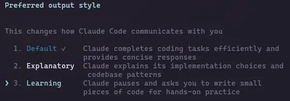

# Poste Backstory X

Il y a moins d'un an :

🚪 Je quittais mon poste de comptable
🤯 Je sortais doucement d'un burnout
🤷‍♀ Je ne connaissais que JavaScript

Aujourdhui :

🖋 Je m'apprête à signer un CDI de Dev Front dans une boîte moderne
📱 J'ai 2 applications mobiles sur le Play Store

Beaucoup me demandent comment j'ai fait.

A mon avis, il n'y a pas de recette miracle, mais j'ai suivi quelques conseils qu'on m'a donné, et aussi souvent, même si ça fait cliché, j'ai suivi mon coeur 😅

Alors je vais te transmettre ce que moi j'ai fait et qui m'a réussi !

1️⃣ **Comment j'ai appris ?**

🏗️ LES BASES  > formations en ligne payantes (celles de @melvynxdev)

Oui, tu peux apprendre gratuitement, mais tu vas partir dans tous les sens parce que le dev c'est vaste ! Melvyn va à l'essentiel, il te cadre et il te booste par son dynamysme.

🛠 LE VRAI DEV > en construisant de vraies apps

Y'a que comme ça que tu pourras toucher du doigt les vraies problématiques et gagner :
. de l'expérience
. de l'assurance
. de la crédibilité

Mais il faut absolument TERMINER ! 1 ou 2 bons projets finis >> 10 projets pas déployés

2️⃣ **Comment j'ai build une app sans experience ?**

Tu t'en doutes, j'ai utilisé les IA, et surtout Claude Code.

MAIS, pas avec le prompt magique "build moi ça et make no mistake" !

D'ailleurs, je n'ai que l'abonnement à 20$ et il me suffit largement pour ma façon de coder ^^

Claude, c'est mon mentor et mon coding buddy 🫶

Je lui parle comme je parlerais à mon lead dev :

. Je veux faire ça, comment tu ferais toi ?
. Et pourquoi tu ferais comme ça et pas comme ça ?
. C'est quoi la différence entre X et Y ?
etc...

Sur mon app AllyMeal, je ne le mets JAMAIS en mode "accept edits on", je valide chacun de ses inputs, je l'interrompt souvent, soit pour poser des questions, soit parce que je me rends compte qu'il part dans une mauvaise direction etc...

Pourquoi j'insiste là-dessus ?

Parce que c'est très IMPORTANT pour ma propre assurance et crédibilité de connaître mon projet (et ça m'a bien servi pour décrocher mon poste. On y reviendra...)

Et aussi parce que AllyMeal, ce n'est pas juste un side project, c'est une app dans laquelle j'ai mis tout mon coeur!

Aussi, n'hésites pas à utiliser la commande /output-style pour passer en mode "Explanatory" ou "Learning", c'est vraiment PEPITE pour les juniors !

ENFIN, c'est important de le dire :

J'ai eu et j'ai encore des gros moments de doutes par rapport à mon app !

Des journées entières à batailler pour la débugger ou l'améliorer, tellement frustrée que j'ai pu penser que j'y arriverais jamais...

Et encore à ce jour, elle est LOIN d'être parfaite, et loin de ma vision idéale !

peut-être que j'ai fait de mauvais choix d'archi ?
que ma base de données est mal optimisée (c'est sûr) ?
que mon code est cracra parfois ? (bien sûr)

Mais elle est en prod !!  🤩 Priceless !

Si tu attends d'avoir un projet parfait pour le publier, tu ne le publieras JAMAIS !

Et si es junior ou reconverti, ne rien publier c'est l'obstacle NUMERO 1 pour obtenir ton 1er poste ou 1er client.

3️⃣ **Comment j'ai décroché un poste ?**

🚧 Tu l'as compris, le plus gros point fort dans mon profil, c'est le fait d'avoir été proactive !

Avoir un projet "solide" (même imparfait) à mettre en avant, ça montre que je suis :

. débrouillarde
. curieuse
. déterminée

👀 Rends-toi visible

Depuis fin 2023, je documente mon parcours de reconversion sur ce blog ET je participe à la commu dev sur X. Pourquoi ?

. rendre des comptes me motive à persévérer
. je vois mes progrès
. ça me démarque des autres candidats
. ça témoigne de ma passion

Je l'ai pas fait pour la fame, très peu de gens lisent mon blog réellement.

Mais ça laisse une trace qui me rend fière et ça permet à un potentiel employeur de voir que je raconte pas de bullshit.

Autre avantage : la commu dev sur X est INCROYABLE !! ❤️ (et je débarque tout juste sur Reddit mais on m'a toujours dit que vous étiez géniaux ici aussi ^^)

Ils partagent leurs savoirs, leurs astuces, leurs galères, et ils te donnent de la force quand tu en as besoin ! ✊

Petit tip si tu viens d'arriver : commence par suivre des comptes de devs et intérragis avec eux.

Personne ne s'intéressera à toi, si tu ne t'intéresse pas à eux !

Et pas de bot pour répondre ! fais des réponses intéressantes uniquement ou bien pour soutenir.

Sois sincère !

C'est important je pense, mais que ce soit sur mon blog ou ici, je ne me suis jamais forcée à poster ou à répondre.

Les gens voient si tu es sincère, et 95% des gens qui me follow l'ont fait parce qu'ils ont apprécié ma spontanéité et mon enthousiasme :)

Dernier tip pour X : Ne parle pas de politique, ne fais pas que des reposts, et ne fais pas sans arrêt de hors sujet.

Sinon, les gens qui veulent voir que de la tech dans leur feed vont te fuir !

📍 Enfin, sois sélectif dans les offres auxquelles tu postules.

Postule uniquement si tu SAIS que tu seras capable de faire le job, sinon, comment veux-tu convaincre qui que ce soit ? 😅

Et si tu fais moins de candidature, tu auras le temps de les soigner !

Faire un mail personnalisé au lieu d'un truc générique attirera l'attention !

Mentionne les noms des technos demandées dans l'offre.

Fais des recherches sur l'activité de la boîte et parles-en un peu.

Montre que tu es motivé(e) pour les rejoindre EUX et pas une autre boîte!

🍀 Et oui, il faut le dire, j'ai aussi eu de la chance :

. de tomber sur une boîte moderne
. qui utilise l'IA de manière intelligente
. dont le lead dev est un ancien reconverti
. où le test technique a consisté à présenter le code de ma propre appli 🤩

Oui, il faut un peu de chance, mais tout le reste, c'est à toi de le mettre en place !

Voilà, ce post est déjà assez long, j'y suis depuis 2h !

Ne va pas penser que c'est GPT qui l'a fait à cause des emojis, ceux qui me suivent savent que j'adooore les emojis **😂**

En fait, c'est GPT qui s'est entraîné sur mes données XD

J'espère avoir pu en aider certains, et en rebooster d'autres.

Force à vous tous ✊

J'espère que vous atteindrez vos objectifs comme j'ai pu atteindre les miens 🔥 🚀 ✨
