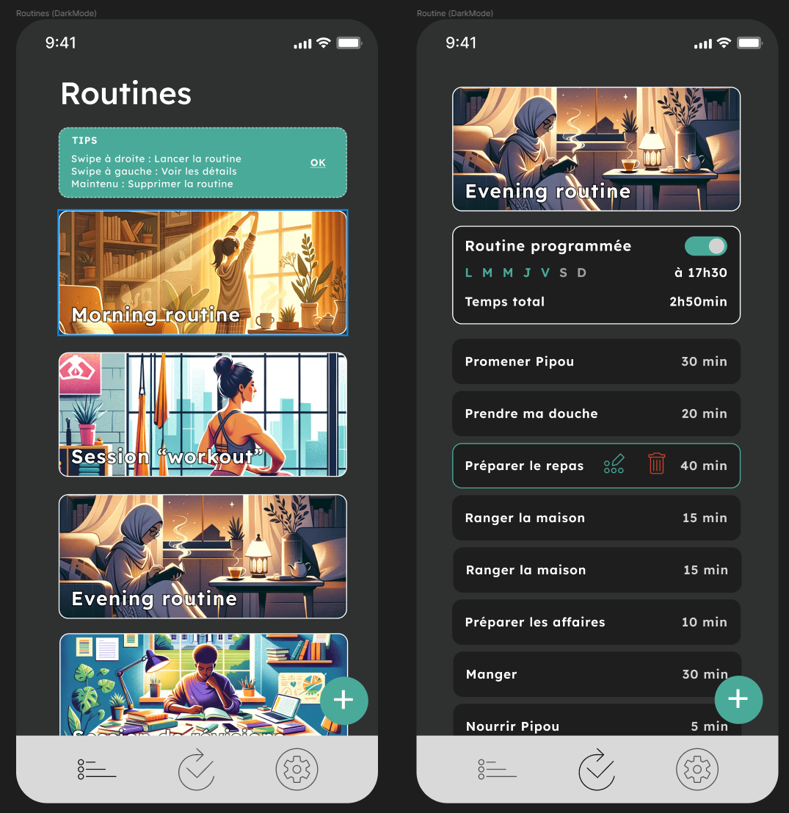
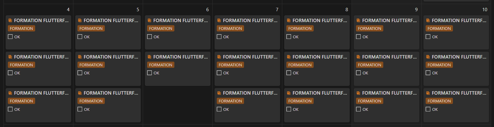
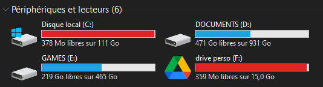

- les petits malades
- moi pas en forme
- des rendez-vous médicaux chiants
- la réception de pleeeein de nouveaux meubles IKEA pour enfin terminer notre ameublement
- une soirée Sushis improvisée chez des amis
- une semaine chargée au travail

Tout ceci a fait que j’ai repoussé maintes fois mes sessions de formation nocturnes.

Du coup, cet article sera plus bref que les autres, et il arrive un peu en retard car nous avions encore beaucoup à faire aujourd’hui (et ce n’est pas fini ! ^^)

## CE QUE J'AVAIS PREVU DE FAIRE

- 8h de formation Flutterflow
- Analyser les résultats de mon enquête utilisateur
- Plannifier la création de ma chaîne Twitch
- Choisir et acheter un micro

## CE QUE J’AI REELLEMENT FAIT

- 2h20 de formation Flutterflow
- Pas d’analyse de mon enquête
- J’ai repris mon ancienne chaîne Twitch, mis à jour ma bio et mes paramètres
- J’ai trouvé, commandé et reçu mon micro
- J’ai acheté un nouveau clavier dans la foulée 😅 (mais je te jure, c’est pas pour moi, c’est pour le confort de tes oreilles sur mon futur stream !! bon OK, un peu pour moi aussi, car je l’adore ^^)
- J’ai bossé sur le design de 2 des écrans principaux de mon appli et j’en suis pas peu fière !! 🤩

J’aime bien ce premier design, qui gagnerait beaucoup à avoir des vignettes “uniformisées”. L’idéal serait de faire appel à un graphiste mais ça reviendrait vite cher car j’en voudrais au moins une vingtaine pour que les utilisateurs puissent choisir la vignette appropriée lorsqu’ils vont créer leurs routines. Je verrai ce que je peux faire à ce niveau là un peu plus tard.

## PROGRAMME DE LA SEMAINE

La semaine prochaine, je vais tenter de mettre un gros focus sur la formation Flutterflow, histoire de rattraper mon retard et essayer de maintenir ma deadline prévue au 16/12.

Et sinon, à part ça, je vais continuer ma formation Flutterflow.

Ah, et aussi… MA FORMATION FLUTTERFLOW bordel !!

A savoir que je me fais opérer Jeudi. Rien de grave, je rentre à la maison le soir même, mais il paraît que les suites sont très douloureuses… donc à voir si je serais en capacité d’au moins être assise à mon bureau ou pas ? 🤞

Et il va sûrement falloir que je formate mon PC car il commence à être un peu fatigué !

## CONCLUSION

J’ai pu voir cette semaine que concilier vie pro + vie familiale + side project peut s’avérer très compliqué par moment. Alors pour l’instant ce n’est pas très grave, la seule qui en pâtit, c’est moi, car ça retarde la fin de ma formation et le début réel de mes développements perso. Mais plus tard, ça risque d’impacter mes potentiels clients et/ou revenus… Wait and see …

Voilà pour le point d’aujourd’hui ! N’hésites pas à me dire en commentaire ce que tu penses de ce merveilleux design (hum!) ou bien à quel point tu es déçu(e) que je n’aie pas respecté mon planning !! 😅

A Dimanche prochain ! 😊
