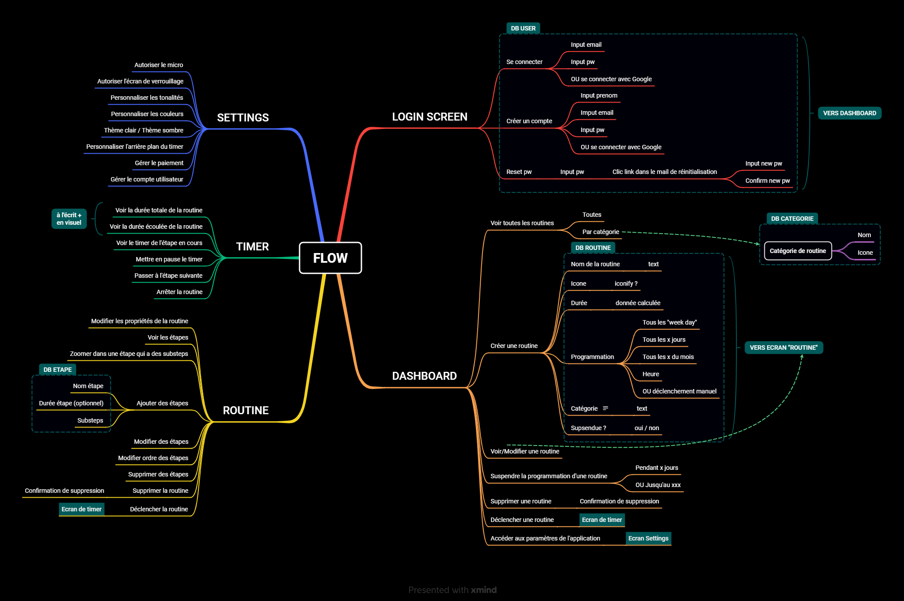
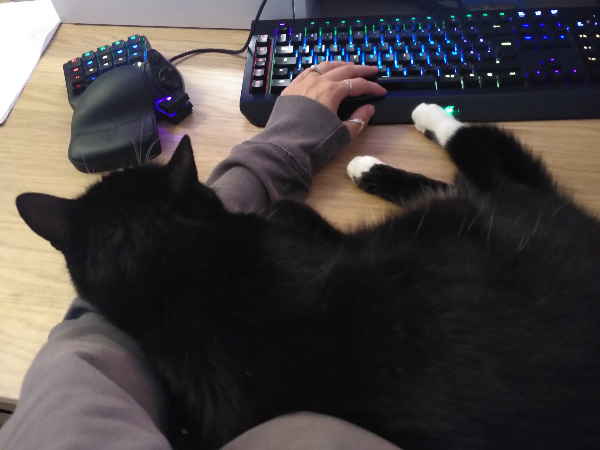

J’ai fixé la date de départ de mon aventure au 10 octobre, le jour où j’ai acheté la formation Bubble, Flutterflow & développeur en Freelance. Car c’est à partir de là que tout s’est emballé.

Pour ce premier point, je vais te détailler ce que j’ai fait les 40 derniers jours, les nouveaux outils et nouveaux concepts que j’ai découvert, ce qui m’a posé problème, comme ça, tu sauras bien où j’en suis.

## QU'EST-CE QUE J'AI FAIT JUSQU'ICI ?

1️⃣ J’ai commencé et achevé la formation à Bubble. 58 vidéos, 30h de contenu, que tu peux multiplier par 2 voire 3 car le but était de reproduire 2 applications web “responsives”, donc adaptée à une vue sur mobile (une marketplace et un SaaS de gestion de projets). Donc j’ai passé mes soirées à regarder les vidéos, faire pause, reproduire, chercher à comprendre, et je peux dire que je connais à présent LES BASES de Bubble ! 🥳

2️⃣ J’ai écouté la formation “Développeur Freelance” en cuisinant, passant l’aspi, promenant le chien, et elle est riche d’informations très intéressantes. Je la reprendrais calmement après avoir vu Flutterflow et je prendrais des notes.

3️⃣ J’ai travaillé sur mon branding à l’aide de chatGPT. J’ai choisi une palette de couleur, un logo et des polices d’écritures. Tout n’est pas parfait, je sais qu’un designer est nécessaire pour ce genre de tâche mais je n’en suis pas encore là. Et honnêtement j’aime bien ce que j’ai fait 😊 Je ferai appel à un pro le moment venu pour reprendre et améliorer tout ça !

4️⃣ J’ai construit le site sur lequel tu te trouves avec un outil no-code que je ne connaissais pas : **Framer.io**

Il est super intuitif, je n’ai vraiment pas galéré pour comprendre les différents aspects (en même temps, avoir abordé Bubble m’a bien aidé je pense sur les terminologies (frame, padding, margin, column/row, etc…)

J’ai carrément utilisé l’IA pour générer ma page d’accueil puis je l’ai totalement personnalisée avec mes couleurs, mes images, mes textes, etc…

j’ai utilisé Tally pour le formulaire de commentaires et MailerLite pour l’inscription au blog (avec envoi d’un mail automatique pour la confirmation d’inscription).

La partie blog n’est pas franchement satisfaisante pour 4 raisons principales :

il y a très peu d’options de mise en page (je ne peux pas centrer ou redimensionner mes images) et donc les articles sont … moches ! tu peux le dire !!

on ne peut pas programmer un article !! 🤦‍♀️

il n’y a aucun moyen de déclencher l’envoi d’un mail à la publication d’un nouvel article 😭

il n’y a pas de système pour commenter !! 😲

5️⃣ J’ai créé un compte LinkedIn, à la base juste pour suivre des comptes qui partagent des infos utiles, que ce soit sur le no-code ou bien sur le marketing digital, le SEO, l’entrepreneuriat, etc… j’ai trouvé pas mal de comptes très quali, je te partagerai tout ça !

6️⃣ Et au final, je me suis laissée embarquer depuis samedi dernier dans un Challenge sur LinkedIn justement ! Organisé par Nina Ramen, le but est de faire un post par jour pendant 5 jours sur un thème donné. Le challenge a cartonné, nous sommes plus de 5000 femmes à l’avoir relevé, rassemblées dans 26 groupes différents. Mon compte LinkedIn est passé de 0 à 126 relations. J’ai créé mon premier carrousel ce jeudi sur Canva. Et avoir la vision de toutes les autres participantes est hyper enrichissant, beaucoup de conseils, d’astuces, de bienveillance, de leçons de vie ! Alors j’ai “perdu” un peu de temps sur mes formations parce que tout ça prend du temps, mais ça vaut vraiment le coup !

7️⃣ J’ai mis en place un espace Notion aux petits oignons pour organiser toutes les connaissances accumulées, gérer l’avancement des différents projets, l’écriture des articles de blog et des posts LinkedIn, visualiser mon branding, brainstormer, etc…

8️⃣ J’ai commencé à planifier ma première application qui sera une application de gestion des routines : Flow !

J’ai commencé par lister les différentes features qui me viennent à l’esprit et je les ai priorisées grâce à la méthode MoSCoW (Je t’en parlerai plus en détail si ça t’intéresse)

J’ai créé un petit formulaire Tally pour faire une enquête utilisateur et établir mes User Personas (profil des utilisateurs).

Et pour faire les choses bien, j’ai intégré le formulaire à une petite Landing page créée sur Framer et j’y ai intégré des visuels que j’ai réalisé sur Figma. Encore un tout nouvel outil pour moi et celui-là il est pas commode !

J’ai diffusé le formulaire grâce à ma petite soeur YouTubeuse qui a presque 10k abonnés (😍) et j’ai récolté pour l’instant 45 retours, dont 34 ont laissé leur adresse mail pour être informé de la sortie de la beta de Flow ! 🥳

J’ai préparé la Mind Map de l’application qui me servira à rédiger mes User Stories (mais j’avoue que j’ai pas bien compris l’utilité des User Stories par rapport à une Mind Map, ou du moins, ça me paraît un peu overkill pour le type d’application que je vais faire, donc à creuser). Pour l’outil, j’ai utilisé xMind, que je préfère à Whimsical, je sais pas pourquoi ^^

Eeeeet … c’est à peu près tout !!

Et je t’avoue que quand je vois la liste de tout ce que j’ai déjà accompli, je n’en crois pas mes yeux ! 👀 J’ai la tête pleine de nouvelles infos, de nouveaux concepts à creuser, de nouveaux outils à appréhender et j’ai du mal à planifier la suite car j’aimerais tout apprendre en même temps ! (Aaaah, si je pouvais ne jamais dormir !! 😅)

## QUAND ET COMMENT J'AI FAIT TOUT Ca

Si tu as suivi, tu sais que je suis maman de deux jeunes enfants et que je bosse comme comptable de 8h30 à 17h30. Je ne travaille pas le mardi car je m’occupe de mon fils, qui n’est pas scolarisé à plein temps. Donc même si je peux avancer un peu plus le mardi, je consacre la majorité de la journée à mon fils, nos rendez-vous, etc…

En majorité, c’est donc le soir entre 21h et 23h que je fais mes formations et/ou toutes les choses que j’ai listé au-dessus. Un peu les samedis et dimanches après-midi pendant la sieste de ma fille aussi. Un peu entre midi et deux quand j’ai du temps.

Tu as l’impression que je ne m’arrête jamais mais je suis tellement passionnée que c’est un véritable plaisir de faire tout ça. Et quand vraiment je suis fatiguée certains soirs, et ça arrive régulièrement avec mes deux loulous, et bien je fais des sessions courtes ou bien pas du tout 😊

Aussi, j’ai des alliés de choix :

- mon espace Notion !

- mes playlists lofi pour être focus comme jamais,

- du café (non c’est pas vrai, le soir je bois une tisane comme les mamies, devant ma petite formation 😅)

- mes 2 écrans 27” et mon casque à réduction de bruit active

- et ma petite Kaly 🐱 qui surveille bien que je fasse tout bien comme il faut ! 😄

## QU'EST-CE QU'IL ME RESTE A FAIRE ?

Il reste encore un loooong chemin à parcourir pour arriver à mon objectif final qui est : travailler en tant que développeuse no-code à mon compte. Soit en vendant mes propres applications, soit en missions Freelance ou pourquoi pas les deux !

Le plan à court terme dans les grandes lignes :

- Formation Bubble pour les applications web (responsives) : OK
- Formation à Flutterflow pour les applis mobiles : en cours
- Créer ma première appli sur Flutterflow
  ➡️ le but c’est de m’entraîner sur ce premier projet histoire de gagner en expérience
- Créer plusieurs autres projets perso, sur Bubble et sur Flutterflow pour gagner encore en expérience et remplir mon portfolio

A moyen terme :

- Me former sur Webflow pour apprendre à faire de beaux sites web
- Apprendre quelques notions de webdesign et apprendre à utiliser Figma et Canva
- Créer mon portfolio sur Webflow
- Recréer mon blog sur Webflow

J’aimerais aussi me former sur les notions techniques de bases liées au développement, parce que ça me paraît essentiel de savoir de quoi je parle concrètement.

- html
- css
- js
- json
- hebergement
- securité des données
- notions légales, rgpd, etc

Et idéalement, me former au marketing digital, principalement Copywriting et SEO.

Enfin, parce que je pense que ça pourrait m’être utile sur certains aspects, j’aimerais apprendre à faire des automatisations poussées sur Make et me pencher un peu sur AirTable/SoftR.

Voilà donc tu vois, ça fait encore beaucoup de choses que j’aimerais faire entrer dans mon petit cerveau ! 🤯

Je ne sais pas si le choix que j’ai fait sur le duo Bubble et Flutterflow est bien. De ce que j’ai vu Bubble est le plus complet en terme d’applications web et il peut aussi faire des applis mobiles en “wrapping” uniquement pour le moment mais la partie mobile est prévue en native pour 2024 apparemment. Quant à Flutterflow, il m’apparaît être le meilleur pour les applis mobiles actuellement.

Enfin, j’aimerais ajouter Webflow en 3e outil pour la partie sites web car il permet de faire des designs beaucoup plus sympa que Bubble à priori.

On peut avoir l’impression que je vais m’éparpiller, mais pour moi, ça reste important de toucher à ces 3 aspects du développement et les différents outils pour y parvenir. Un peu comme une manière pour moi de gagner en expérience et de combler mon manque de connaissance dans ces domaines.

Quand je pense aux 20 ans que j’ai passé dans la comptabilité, je me dis que si j’avais été dans le dev depuis tout ce temps, je serais une vraie tueuse à l’heure qu’il est… Mais bon, je me dis aussi que je n’ai “que” 38 ans et qu’il me reste donc une bonne grosse vingtaine d’années de carrière donc ça peut se rattraper ! Etant donné que les techs et l’informatique évoluent à une vitesse phénoménale, je me dis que tout n’est pas perdu ! 😊

## LA SEMAINE prochaine

Au programme la semaine prochaine, c’est assez calme. Formation Flutterflow au max, et lundi j’ai une masterclass de Raphaële Carrère, experte en copywriting. Je reverrai mes deadlines comme ça je vous en parlerai dans mon prochain post. Et je vais me pencher sur les wireframes de mon appli, sur Whimsical je pense, car j’ai vu qu’il y avait un module dédié vachement pratique.

Voilà, je pense qu’on a fait pas mal le tour pour ce premier point d’avancement. Moi ça m’a bien aidée à voir tout ce que j’avais déjà abattu. Toi, ça t’a peut-être fait un peu mal à la tête 😅

Si tu es toi aussi débutant dans le domaine du dev no-code ça t’a peut-être inspiré ou questionné ? Si tu es confirmé ou senior dev, ou si tu es solopreneur quelque soit le domaine, tu as peut-être des conseils, des avis ? Dans tous les cas, quel que soit ton horizon, je serai ravie d’avoir tes retours alors n’hésites pas à m’écrire sur le formulaire juste en-dessous !

Merci de m’avoir lue, à la semaine prochaine !!
