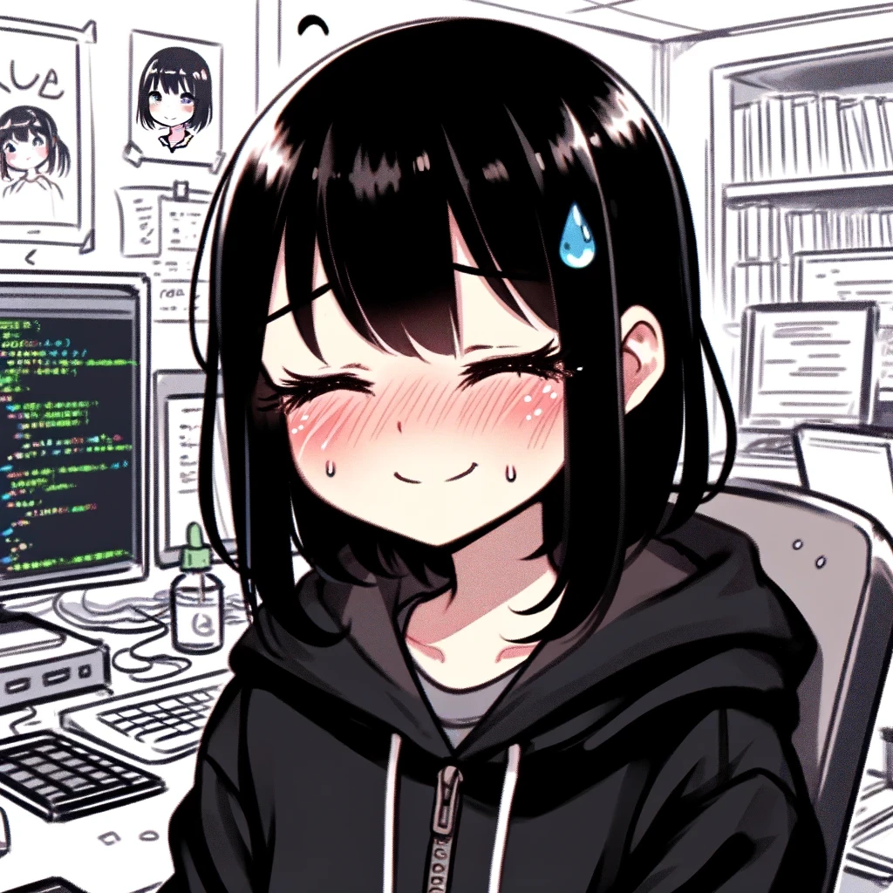

Alors, ces 2 dernières semaines ont été un peu “brouillon” car j’ai tellement de choses à apprendre encore, et je me suis montrée tellement impatiente de tout voir, que j’ai fait un peu de tout et ce n’est pas vraiment la bonne méthode.

J’ai commencé à voir un peu TypeScript via la formation de Grafikart. Puis j’ai voulu absolument commencer à pratiquer la création de sites web simples, pour être rapidement opérationnelle de ce côté-là. J’ai reproduis la page d’accueil d’un site que je trouvais sympa (je te montre ça dans quelques instants !). Et puis, je me suis dis que ce serait quand même important d’apprendre React avant de continuer à “crafter” des sites, puisque c’est la tech que je veux utiliser à terme…. Alors, j’ai commencé la formation React de Grafikart ! Sans avoir terminé TypeScript…

A tout commencer en même temps, la mémorisation des concepts et des syntaxes devient compliquée. Surtout pour mon cerveau de poisson rouge ! Les quelques leçons que j’ai suivies sur TypeScript, j’ai déjà tout oublié, et c’est dommage, c’est du temps perdu… Et même si TS n’est pas la partie la plus excitante à apprendre, je reste persuadée qu’il est important que je commence par là car je pourrais ensuite l’appliquer dans mon code et donc pratiquer et mémoriser.

## MA PREMIERE PAGE WEB

Pour autant, je n’ai pas chômé non plus, car comme je te disais, j’ai mis en pratique les notions de HTML que j’avais vu pendant ma formation JavaScript pour recréer de A à Z la page d’accueil d’un site que je trouvais sympa. J’ai donc appris à structurer du HTML et j’ai choisi d’utiliser directement Tailwind plutôt que de pratiquer du CSS pur et autant te dire que j’ai adoré Tailwind ! Alors, je n’ai pas forcément encore les bonnes pratiques (coucou les classes dans n’importe quel ordre ! xD je ne connaissais pas encore le plugin Tailwind de Prettier ^^), mais j’ai trouvé que c’était très intuitif à utiliser et que leur doc était hyper claire et pratique.

J’ai mis environ 6h à créer la page d’accueil (mode limace activé 😅). Hey, faut bien commencer quelque part ! C’est en développant des trucs qu’on devient un développeur super productif non ? Seulement voila, grossière erreur, je me suis dis que le responsive, je verrais APRES… Alors que les classes dans Tailwind, sont par défaut pensées en “mobile first”. J’ai donc dû revoir TOUUUUTES mes classes pour rendre mon site responsive, et ça m’a pris 6h de plus !! 😅

Alors la version mobile n’est clairement pas parfaite, je n’ai pas eu le temps de peaufiner les paddings, les marges, etc… Mais j’ai compris le principe et je saurais l’appliquer, mieux, à l’avenir.

Et en parallèle, j’ai appris à setup Tailwind sur un projet, à commit, push et pull sur GitHub (avec des belles descriptions pour mes commits tout comme il faut xD) et à utiliser Vercel pour déployer mon “site” ! Et c’est peut-être un détail pour vous, mais pour moi… (j’arrête direct ici cette ref. qui me fait sentir beaucoup trop vieille 😅) Mais bon, t’as bien compris qu’il m’en fallait peu pour me sentir fière 😂

Du coup, j’abrège le suspense et je te dévoile mon chef-d’oeuvre (dont je n’ai pas fait le design (tousse)). ← Tu remarqueras le soin que j’ai mis à fermer cette double parenthèse, parce que OUI, la syntaxe c’est IMPORTANT !!

Le voici, le voilà, le beau, l’unique (non!) site de [siena-design](https://siena-design.vercel.app/) !

Tu trouves que j’en fait trop ? 😅

Moi dans quelques mois quand je relirais ces lignes et ma fierté de newbie :

Je te mets le lien du repo pour que tu voies mes classes Tailwind en bordel ^^ : https://github.com/StellaDePaperStreet/siena-design.git

Enfin voilà, du coup, je n’ai pas plus de nouvelles pour cette semaine. Objectif des 2 prochaines semaines : Apprendre TYPESCRIPT ! La formation de Grafikart dure 4h de vidéos, qu’on peut multiplier par 3 ou 4 pour inclure les moments de pratique. Y’a du boulot ! C’est partiiiii ! 🚀
